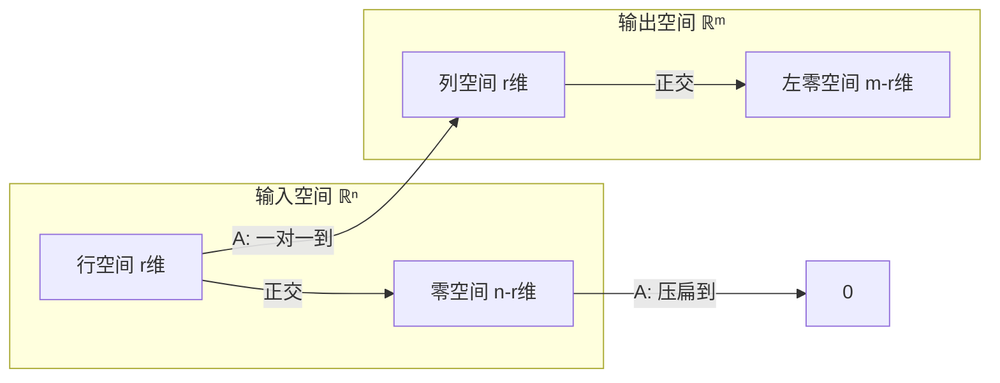

# 线性代数

> 神经网络里的每一层，本质上就是一次矩阵乘法。你不必成为数学家，但如果你能「看见」矩阵在做的事情，AI 就不再是黑箱。

---

## 从一段话理解线性代数

先说人话，再说公式。

**向量** 是一串数。一张图的像素、一句话的 embedding、一个 batch 的样本——全是向量。

**矩阵** 是一个「变换器」。给它一个向量，它吐出一个新向量。神经网络里 `nn.Linear(768, 3072)` 就是一个 $3072 \times 768$ 的矩阵，把 768 维的输入变成 3072 维的输出。

**线性代数** 就是研究「向量被矩阵变换之后发生了什么」的学问。哪些方向只被拉伸？哪些方向被压扁到零？能不能把矩阵拆成更简单的几块？这些问题的答案，正是 PCA、LoRA、Attention 的数学基础。

---

## 1. 向量：不只是「箭头」

### 1.1 向量的三种面目

同一个向量 $v = \begin{bmatrix} 3 \\ 2 \end{bmatrix}$，有三种理解方式：

| 视角 | $v$ 是什么 | 什么时候用 |
|------|-----------|-----------|
| **几何** | 从原点指向 (3, 2) 的箭头 | 建立直觉，理解「方向」和「长度」 |
| **代数** | 一列数 $(3, 2)^T$ | 写代码、推公式 |
| **数据** | 一个有两个特征的样本 | 机器学习里的实际含义 |

在 ML 里，数据视角才是主角。一个 768 维的词向量不是你能画出来的箭头，但它和二维箭头遵守完全相同的规则。

### 1.2 向量的基本运算

**加法**：$\begin{bmatrix} 1 \\ 2 \end{bmatrix} + \begin{bmatrix} 3 \\ 1 \end{bmatrix} = \begin{bmatrix} 4 \\ 3 \end{bmatrix}$

几何上就是拼在一起——先走第一个箭头，再走第二个。

**数乘**：$2 \cdot \begin{bmatrix} 1 \\ 2 \end{bmatrix} = \begin{bmatrix} 2 \\ 4 \end{bmatrix}$

拉伸（或缩短）箭头，方向不变（负数会反向）。

**内积**：$\begin{bmatrix} 1 \\ 2 \end{bmatrix} \cdot \begin{bmatrix} 3 \\ 4 \end{bmatrix} = 1 \times 3 + 2 \times 4 = 11$

> 💡 **几何直觉**：内积 = 一个向量在另一个向量方向上的投影长度 × 另一个向量的长度。内积为 0 意味着两个向量垂直。Attention 里的 $QK^T$ 就是算一堆向量两两之间的内积。

---

## 2. 线性组合：万物的起点

取两个向量 $v_1, v_2$ 和两个数 $c_1, c_2$，构造
$$c_1 v_1 + c_2 v_2$$

这就是**线性组合**。它的几何意义极其重要：

- 给定两个不共线的向量，它们的**所有线性组合**能填满整个平面
- 给定两个共线的向量，它们的线性组合只能填满一条线
- 给定两个共线且为零的向量（都是零向量），只能填满一个点

这三种情况，恰好对应矩阵秩的三个等级——后面会讲。

> 💡 **在 ML 里**：神经网络的前向传播 $Wx$ 就是 $W$ 各列以 $x$ 各分量为系数的线性组合。你喂进去的 $x$ 选定了 $W$ 各列的「混合配方」。

---

## 3. 矩阵：线性变换的「配方」

### 3.1 什么是线性变换

一个变换 $T$ 是**线性的**，当它满足两条：

1. $T(u + v) = T(u) + T(v)$ —— 和的变换 = 变换的和
2. $T(cv) = c T(v)$ —— 缩放的变换 = 变换的缩放

换句话说：**线性变换保持「线性组合的结构」不变**。先组合再变换，等于先变换再组合。

### 3.2 矩阵就是线性变换的「说明书」

任何线性变换都可以用一个矩阵来表示。矩阵的**列**告诉你：原空间的标准基向量 $\hat{i}, \hat{j}$ 被变换到哪里去了。

例如矩阵 $A = \begin{bmatrix} 2 & -1 \\ 1 & 1 \end{bmatrix}$：
- 第一列 $\begin{bmatrix} 2 \\ 1 \end{bmatrix}$ 是 $\hat{i}$ 的去向
- 第二列 $\begin{bmatrix} -1 \\ 1 \end{bmatrix}$ 是 $\hat{j}$ 的去向

有了这两个去向，整个空间的变换就唯一确定了——因为其他向量都是 $\hat{i}$ 和 $\hat{j}$ 的线性组合。

这就是理解矩阵乘法的**列图景**：$Ax$ 是用 $x$ 的各分量作为系数，对 $A$ 的各列做线性组合。不要死记「行乘列」的规则，先在脑子里看到这个过程。

### 3.3 矩阵乘法的四种理解

同一个 $C = AB$，有四种等价的理解方式：

| 视角 | 公式 | 直觉 |
|------|------|------|
| **列组合** | $C$ 第 $j$ 列 = $A \times (B$ 第 $j$ 列$)$ | 先对 $B$ 的列做线性组合，得到 $A$ 各列的新配方 |
| **行组合** | $C$ 第 $i$ 行 = $(A$ 第 $i$ 行$) \times B$ | $A$ 的行作为系数，组合 $B$ 的行 |
| **外积和** | $AB = \sum_k (A$ 第 $k$ 列$) \times (B$ 第 $k$ 行$)$ | 拆成一堆秩-1 矩阵的和，揭示矩阵的「骨架」 |
| **纯粹计算** | $C_{ij} = \sum_k A_{ik} B_{kj}$ | 写代码用的，不是用来理解的 |

---

## 4. 消元与 $A = LU$：解方程的正确方式

### 4.1 消元不只是「算」

考虑方程 $Ax = b$。你当然可以 $\text{inv}(A) \times b$，但求逆矩阵是个又慢又不稳定的操作。正确的方式是**消元**——把 $A$ 变成上三角矩阵，然后从下往上代回去。

消元的实质不是操作步骤，而是**矩阵分解**：
$$A = LU$$

- $L$（下三角）：存储了每次消元的乘数
- $U$（上三角）：消元后的结果

解 $Ax = b$ 变成两步：
1. 解 $Lc = b$（从上往下一代，$O(n^2)$）
2. 解 $Ux = c$（从下往上一代，$O(n^2)$）

> 💡 **在 ML 里**：你不会手写消元，但 PyTorch 底层用了 $LU$ 分解的变体来做矩阵求逆和行列式计算。理解这一点，你就知道为什么「不要自己写矩阵求逆」——数值稳定性比你想象的重要。

---

## 5. 四个基本子空间：矩阵的「解剖学」

这是线性代数最美、最深刻的结果之一。MIT 的 Gilbert Strang 把它称为「线性代数的心脏」——我同意。

### 5.1 矩阵做了什么：两个视角

给定一个 $m \times n$ 矩阵 $A$：

- **输入侧**（$\mathbb{R}^n$）：$A$ 接受一个 $n$ 维向量
- **输出侧**（$\mathbb{R}^m$）：$A$ 吐出一个 $m$ 维向量

输入侧有两类特殊的向量：

| 向量类型 | 定义 | 发生了什么 |
|---------|------|-----------|
| **行空间的向量** | 可以被 $A$ 的行线性组合出来的向量 | 经过 $A$ 后变成列空间里的非零向量 |
| **零空间的向量** | 满足 $Ax = 0$ 的向量 | 经过 $A$ 后被「压扁」到原点 |

输出侧也有两类：

| 向量类型 | 定义 | 从哪里来 |
|---------|------|---------|
| **列空间的向量** | 可以被 $A$ 的列线性组合出来的向量 | 由行空间的向量变换而来 |
| **左零空间的向量** | 满足 $y^T A = 0$ 的向量 | 没有任何输入能产生它们 |

### 5.2 四子空间关系图

- 行空间 $\perp$ 零空间，两者的维数之和 = $n$
- 列空间 $\perp$ 左零空间，两者的维数之和 = $m$
- $A$ 把行空间**一一映射**到列空间（两者维数相同，都是 $r$）
- 零空间里的向量全部被「压扁」到原点

### 5.3 有什么用

**$Ax = b$ 什么时候有解？** $b$ 必须在 $A$ 的列空间里。

**有多少个解？** 如果零空间不只有零向量，那么解 = 一个特解 + 零空间里的任意向量。换言之，无穷多个。

> 💡 **在 ML 里**：一个过参数化的神经网络有巨大的零空间——无穷多组权重能实现几乎相同的效果。正则化（L2 weight decay）就是从零空间里挑一个「范数最小的」。这不是玄学，是子空间几何。

---

## 6. 正交性与最小二乘：当精确解不存在

### 6.1 投影：找个「最近」的替身

如果 $b$ 不在 $A$ 的列空间里，$Ax = b$ 无解。退一步——找 $\hat{x}$，使得 $A\hat{x}$ 是列空间里离 $b$ 最近的点。

这个「最近点」就是 $b$ 在列空间上的**投影**：
$$\hat{x} = (A^T A)^{-1} A^T b$$

投影矩阵 $P = A(A^T A)^{-1} A^T$ 有两个标志性性质：
- $P^2 = P$：投一次和投两次一样（已经在线上了）
- $P^T = P$：对称

### 6.2 最小二乘 = 线性回归的数学

线性回归：找 $\beta$ 让 $X\beta \approx y$。这就是典型的「$b$ 不在列空间里」的问题。

$$\hat{\beta} = (X^T X)^{-1} X^T y$$

这个公式和上面 $\hat{x}$ 的公式**一模一样**——因为线性回归就是投影。你理解了投影，就理解了线性回归为什么长这样。

> 💡 **正交性在 ML 里渗透各处**：正交初始化（让权重矩阵的列不共线）、权重衰减（等价于在投影上加约束）、正交正则化——全部源于这里。

---

## 7. 行列式：一次变换改变多少体积

### 7.1 一句话：体积的缩放因子

矩阵 $A$ 把空间里的一个单位立方体变成了某个平行多面体。$\det(A)$ 就是这个多面体的**有向体积**。

- $\det(A) > 0$：空间没有被翻转
- $\det(A) < 0$：空间被「镜像」了
- $\det(A) = 0$：多面体被压扁了（体积为 0）——矩阵**不可逆**

几个核心性质，不是定义但极其实用：

| 性质 | 直觉 |
|------|------|
| $\det(AB) = \det(A) \det(B)$ | 先变换 $B$ 再变换 $A$，体积缩放因子相乘 |
| $\det(A^{-1}) = 1/\det(A)$ | 逆变换把体积放回去 |
| $\det(A^T) = \det(A)$ | 转置不改变体积（列变行，空间「胖瘦」相同） |
| $\det(cA) = c^n \det(A)$ | 每个维度各拉伸 $c$ 倍 |

### 7.2 在 ML 中什么时候出现

你在 PyTorch 里很少直接算行列式（它慢而且数值不稳定），但行列式的直觉无处不在：

- 协方差矩阵的行列式（广义方差）衡量数据分布的「体积」
- 行列式为 0 → 矩阵奇异 → 优化困难（Hessian 条件数爆炸）
- 概率密度里的归一化常数（多元高斯分布的协方差矩阵行列式）

---

## 8. 特征值与特征向量：发现矩阵的「天然方向」

### 8.1 核心直觉

矩阵在大多数方向上会把向量扭得面目全非。但在某些特殊方向上，矩阵的作用只是**拉伸**——不改变方向，只改变长度：
$$Ax = \lambda x$$

- $x$ 叫**特征向量**——矩阵的「天然方向」
- $\lambda$ 叫**特征值**——在这个方向上的拉伸倍数

### 8.2 对角化：换个坐标系，矩阵变「简单」

如果矩阵 $A$ 有 $n$ 个线性独立的特征向量，把它们排成矩阵 $S$：
$$A = S \Lambda S^{-1}$$

其中 $\Lambda$ 是对角矩阵，对角线上是特征值。这意味着：**在特征向量构成的坐标系下，$A$ 就是一个纯拉伸**。复杂的变换只是因为观察的「姿势」不对。

### 8.3 对称矩阵是「好矩阵」

对称矩阵（$A = A^T$）在 ML 中随处可见——协方差矩阵、Hessian、Gram 矩阵——它们有绝佳的性质：

- 所有特征值都是实数（不是复数）
- 特征向量可以选成正交的
- 谱分解：$A = Q \Lambda Q^T$，$Q$ 是正交阵

### 8.4 正定 × 负定 × 不定

- **正定**：所有特征值 $> 0$。是一个「碗」——梯度下降的乐土
- **负定**：所有特征值 $< 0$。是一个「倒扣的碗」
- **不定**：有正有负。是一个「马鞍」——梯度下降的噩梦

> 💡 **在 ML 里**：Hessian 的正定性告诉你是在碗底（收敛了）还是在马鞍上（还在挣扎）。协方差矩阵正定意味着数据在每个方向上都有方差——没有冗余特征。

---

## 9. 奇异值分解 SVD：最普适的分解

### 9.1 为什么 SVD 是「终极武器」

特征值分解有一个致命限制：要求矩阵是方阵。现实中的矩阵几乎都是长方形的——1000 个样本 × 768 维特征，你怎么对角化？

SVD 没有这个限制。**任何矩阵** $A$（$m \times n$，秩 $r$）都可以分解为：
$$A = U \Sigma V^T$$

- $U$（$m \times m$）：列的集合，前 $r$ 列是列空间的标准正交基
- $\Sigma$（$m \times n$）：对角矩阵，$\sigma_1 \ge \sigma_2 \ge \dots \ge \sigma_r > 0$
- $V$（$n \times n$）：列的集合，前 $r$ 列是行空间的标准正交基

### 9.2 几何动作：旋转→拉伸→旋转

把 $A$ 作用到一个向量上的三部曲：
1. $V^T$：旋转（把向量转到 $A$ 的「天然坐标系」）
2. $\Sigma$：沿坐标轴拉伸（每个方向拉伸 $\sigma_i$ 倍）
3. $U$：再旋转（转回原始坐标系）

任何线性变换的本质就这三步。没有例外。

### 9.3 截断 SVD：丢掉噪音，保留本质

只保留前 $k$ 个最大的奇异值：
$$A_k = U_k \Sigma_k V_k^T$$

这就是 **Eckart-Young 定理**的精髓：$A_k$ 是所有秩-$k$ 矩阵中，在 Frobenius 范数意义下最接近 $A$ 的那一个。

> 💡 **这就是 PCA 的数学本质**。PCA 不是魔法——它是 SVD 换了个名字。对中心化数据矩阵 $X$ 做 SVD，右奇异向量 $V$ 的前 $k$ 列就是前 $k$ 个主成分。

### 9.4 SVD 在 ML 中的三个高光时刻

| 场景 | SVD 怎么用 |
|------|-----------|
| **PCA 降维** | $X \approx U_k \Sigma_k V_k^T$，用 $U_k \Sigma_k$ 作为降维后的数据 |
| **LoRA 微调** | $\Delta W = BA$ 是对原权重矩阵的低秩修正，本质上是加了秩为 $r$ 的 SVD 项 |
| **推荐系统** | 用户-物品评分矩阵 $R \approx U_k \Sigma_k V_k^T$，用分解后的低秩近似做协同过滤 |

---

## 10. 基变换：换个角度看同一个变换

### 10.1 矩阵 ≠ 变换

一个线性变换可以用不同的矩阵来表示——取决于你选了什么样的基（坐标系）。
$$B = P^{-1} A P$$

$A$ 和 $B$ 是**同一个变换**在两个不同基下的矩阵。当你觉得矩阵很复杂时，可能只是基选得不好。

### 10.2 为什么基变换在 ML 中极其重要

**嵌入层（Embedding）就是基变换**。把离散的 token 映射到一个连续向量空间，本质上是在选择一个好的基来表示语言。

预训练嵌入（Word2Vec、BERT embedding）之所以有价值，正是因为它们**学到了一个好的基**——在这个基下，语义相近的词靠得近，语义关系（国王 - 男人 + 女人 ≈ 王后）表现为向量运算。

---

## 11. 神经网络 = 线性变换的嵌套

### 11.1 一层：$y = Wx + b$

这是一个**仿射变换** = 线性变换（$Wx$）+ 平移（$+b$）。

$W$ 把输入空间拉伸 / 旋转 / 压缩，$b$ 把结果整体平移。没有非线性激活函数的话，多层网络会坍缩成等效的一层——因为线性变换的复合还是线性变换。

### 11.2 加入 ReLU：分段线性

$$\text{ReLU}(Wx + b) = \max(0, Wx + b)$$

ReLU 把空间「折叠」了一下——把负值全部剪平到零。这使得多个线性变换 + ReLU 叠在一起不再是单一的线性变换，而是**分段线性**——整个输入空间被切割成许多线性区域，每个区域内网络的行为都是线性的。

这就是为什么神经网络能逼近任意复杂函数：它用足够多的分段线性区域来拼接出任何形状。

### 11.3 梯度和反向传播

神经网络训练的核心是导数，而导数是线性代数的事。对于 $y = Wx$，$\frac{\partial y}{\partial x} = W^T$——正好是 $W$ 的转置。反向传播就是把梯度从输出层一路「转置」回输入层的过程。

---

## 💭 个人理解

### 线性代数是一门「结构」的语言

学完线代之后回头看 AI，你会发现所有东西都是同一个主题的变奏：

- 梯度下降 = 在高维参数空间里沿着最陡的方向往下滚
- Attention = 在度量向量之间的夹角（内积）
- PCA = 找到数据方差最大的方向（最大特征值对应的特征向量）
- LoRA = 微调时只动矩阵的「低秩部分」（截断 SVD）
- Embedding = 选一个好的基来表示离散对象

### Gilbert Strang 的洞见：先看见，再算

线性代数的教学通常有两种极端：一种是纯计算（行列式展开、矩阵求逆，算到你怀疑人生），一种是纯抽象（从公理体系开始，定义完就证定理）。Gilbert Strang 走了第三条路——**先让你看见，再让你算**。

他花了半辈子推广一个简单的视角：矩阵乘法不是「行乘列」，而是「列的线性组合」。只要你能在脑子里把 $Ax$ 看成「$A$ 各列的加权和」，你就会发现神经网络的前向传播、PCA 的投影、Attention 的加权求和，是同一件事的不同面目。

3Blue1Brown 把这个视角做成了动画——强烈推荐花一个下午刷完「线性代数的本质」系列。不是要你学新东西，而是让你把已经知道的东西**「看见」**。有些东西你看十遍公式不一定能穿透，看一遍动画就通了。

### 为什么线代让你变成更好的 ML 工程师

不是因为你会手算 SVD（你不会，PyTorch 会），而是因为你有了**直觉**。你知道 `nn.Linear` 在做什么，你知道为什么权重初始化选正交的比随机的收敛更快，你知道 LoRA 的 rank 设太大浪费显存、设太小学不到东西——这些不是调参玄学，是线代告诉你的答案。

---

## 进一步阅读

| 资源 | 适合什么 |
|------|---------|
| **Gilbert Strang《Introduction to Linear Algebra》第 6 版** | 系统性学习：从向量到 SVD，一条清晰的主线，配有大量习题 |
| **MIT 18.06 公开课**（Strang 亲授，34 讲） | 不想看书就看视频，Strang 在黑板前如讲故事般展开 |
| **3Blue1Brown「线性代数的本质」** | 几何直觉的巅峰。看完之后所有公式都会有画面感 |
| **《Matrix Analysis》Horn & Johnson** | 进阶：想深挖特征值的扰动理论、矩阵不等式时用 |
