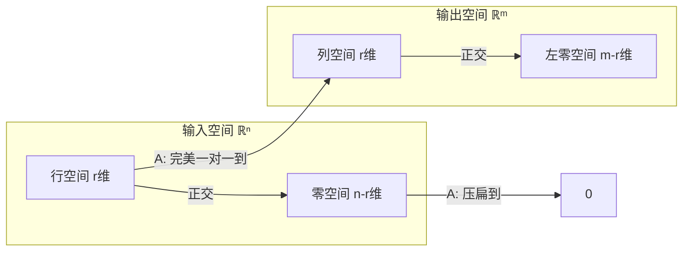

# 二、方程与子空间

## 6. 消元与 $A = LU$：解方程的正确方式

### 6.1 不只是「算」——消元就是矩阵分解

考虑 $Ax = b$。你当然可以 `torch.linalg.inv(A) @ b`，但直接求逆又慢又数值不稳定。正确姿势是**高斯消元**。

用矩阵的语言重说消元：把 $A$ 分解为
$$A = LU$$

- $L$（**L**ower triangular，下三角矩阵）：对角线上全是 1，非零元存储了每次消元时用的乘数
- $U$（**U**pper triangular，上三角矩阵）：消元后的结果，主元在对角线上

### 6.2 一个完整的手算例子

**原方程** $Ax = b$：

$$\begin{bmatrix} 2 & 1 & -1 \\ -3 & -1 & 2 \\ -2 & 1 & 2 \end{bmatrix} \begin{bmatrix} x_1 \\ x_2 \\ x_3 \end{bmatrix} = \begin{bmatrix} 8 \\ -11 \\ -3 \end{bmatrix}$$

**消元过程**：

要消掉第 2 行第 1 列的 $-3$，乘数是 $-\frac{3}{2}$。第 2 行 += $(-\frac{3}{2}) \times$ 第 1 行：

$$\rightarrow \begin{bmatrix} 2 & 1 & -1 \\ 0 & \frac{1}{2} & \frac{1}{2} \\ -2 & 1 & 2 \end{bmatrix}, \quad b \rightarrow \begin{bmatrix} 8 \\ 1 \\ -3 \end{bmatrix}$$

要消掉第 3 行第 1 列的 $-2$，乘数是 $-1$。第 3 行 += $(-1) \times$ 第 1 行：

$$\rightarrow \begin{bmatrix} 2 & 1 & -1 \\ 0 & \frac{1}{2} & \frac{1}{2} \\ 0 & 2 & 1 \end{bmatrix}, \quad b \rightarrow \begin{bmatrix} 8 \\ 1 \\ 5 \end{bmatrix}$$

要消掉第 3 行第 2 列的 2，乘数是 $4$。第 3 行 += $4 \times$ 第 2 行：

$$\rightarrow \underbrace{\begin{bmatrix} 2 & 1 & -1 \\ 0 & \frac{1}{2} & \frac{1}{2} \\ 0 & 0 & 3 \end{bmatrix}}_{U}, \quad b \rightarrow \underbrace{\begin{bmatrix} 8 \\ 1 \\ 9 \end{bmatrix}}_{c}$$

**回代**：$Ux = c$

1. $3x_3 = 9 \implies x_3 = 3$
2. $\frac{1}{2}x_2 + \frac{1}{2} \cdot 3 = 1 \implies x_2 = -1$
3. $2x_1 + (-1) - 3 = 8 \implies x_1 = 6$

解为 $x = \begin{bmatrix} 6 \\ -1 \\ 3 \end{bmatrix}$。验证：$2 \cdot 6 + (-1) - 3 = 8$ ✓

### 6.3 $A = LU$ 分解长什么样

上面每个消元步骤，本质是在**左边乘一个初等矩阵**。把所有这些初等矩阵的逆按顺序乘起来，就是 $L$：

$$L = \begin{bmatrix} 1 & 0 & 0 \\ -\frac{3}{2} & 1 & 0 \\ -1 & 4 & 1 \end{bmatrix}, \quad U = \begin{bmatrix} 2 & 1 & -1 \\ 0 & \frac{1}{2} & \frac{1}{2} \\ 0 & 0 & 3 \end{bmatrix}$$

可以验证 $LU = A$：

$$\begin{bmatrix} 1 & 0 & 0 \\ -\frac{3}{2} & 1 & 0 \\ -1 & 4 & 1 \end{bmatrix} \begin{bmatrix} 2 & 1 & -1 \\ 0 & \frac{1}{2} & \frac{1}{2} \\ 0 & 0 & 3 \end{bmatrix} = \begin{bmatrix} 2 & 1 & -1 \\ -3 & -1 & 2 \\ -2 & 1 & 2 \end{bmatrix} = A$$

解 $Ax = b$ 变成超快的两步：
1. 解 $Lc = b$（前向代入——从上往下，$O(n^2)$）
2. 解 $Ux = c$（回代——从下往上，$O(n^2)$）

总复杂度 $O(n^2)$，而直接求逆要 $O(n^3)$。并且不必重复——如果解多个 $b$，$L$ 和 $U$ 只需算一次。

> 💡 **在 ML 里**：你不会手写消元，但 PyTorch 的 `torch.linalg.solve` 底层就是 $LU$ 分解（或其变体）。理解了这一点，就会明白为什么「解 $Ax=b$」比「求 $A^{-1}$ 再乘」快得多、稳得多。

---

## 7. 四个基本子空间：矩阵的「解剖学」

[上一章](vectors-to-rank.md)我们学了秩 = 列空间的维数。现在把秩放进一个完整的结构里——每个矩阵都天然关联四个子空间。

### 7.1 给定一个矩阵，它在做什么

设 $A$ 是 $m \times n$ 矩阵，秩为 $r$。

- $A$ 接受 $n$ 维输入，产出 $m$ 维输出
- 有些输入被 $A$「压扁」成了零向量
- 有些输出是 $A$ 永远产生不了的

这四类构成了四个子空间：

**输入侧（$\mathbb{R}^n$）**：

| 子空间 | 定义 | 命运 | 维数 |
|--------|------|------|------|
| **行空间** $C(A^T)$ | $A$ 的行向量能张成的空间 | 经过 $A$ 后变成列空间里的非零向量 | $\color{blue}{r}$ |
| **零空间** $N(A)$（也叫**解空间**） | 所有满足 $Ax=0$ 的 $x$ | 被 $A$「压扁」到原点 | $\color{red}{n-r}$ |

> 零空间在中文教材中常被称为**解空间**（solution space）——因为它是齐次线性方程组 $Ax=0$ 的全部解构成的向量空间。求出一组基，就得到了**基础解系**（fundamental system of solutions），它是零空间的一组极大线性无关的解向量，任何解都可以由它们线性表出。

**输出侧（$\mathbb{R}^m$）**：

| 子空间 | 定义 | 来源 | 维数 |
|--------|------|------|------|
| **列空间** $C(A)$ | $A$ 的列向量能张成的空间 | 只有行空间里的向量能到达这里 | $\color{blue}{r}$ |
| **左零空间** $N(A^T)$ | 所有满足 $y^TA=0$ 的 $y$ | 没有任何输入能产生它们 | $\color{red}{m-r}$ |

维度加起来刚好填满：输入侧 $\color{blue}{r} + \color{red}{n-r} = n$，输出侧 $\color{blue}{r} + \color{red}{m-r} = m$。

### 7.2 一个具体矩阵的四个子空间

$$A = \begin{bmatrix} 1 & 2 \\ 2 & 4 \\ 3 & 6 \end{bmatrix}$$

这是一个 $3 \times 2$ 的矩阵。第二列 = 2 × 第一列 → **秩 $r = 1$**。

- **列空间**（在 $\mathbb{R}^3$ 中，维数 $r=1$）：所有 $c \begin{bmatrix} 1 \\ 2 \\ 3 \end{bmatrix}$。一条直线。
- **行空间**（在 $\mathbb{R}^2$ 中，维数 $r=1$）：所有 $c \begin{bmatrix} 1 \\ 2 \end{bmatrix}$。也是一条直线。
- **零空间**（在 $\mathbb{R}^2$ 中，维数 $n-r=1$）：满足 $x_1 + 2x_2 = 0$ 的所有向量，即所有 $c \begin{bmatrix} -2 \\ 1 \end{bmatrix}$。一条直线——和行空间**正交**。这组基 $\{ \begin{bmatrix} -2 \\ 1 \end{bmatrix} \}$ 就是该齐次方程组 $Ax=0$ 的**基础解系**。
- **左零空间**（在 $\mathbb{R}^3$ 中，维数 $m-r=2$）：满足 $y_1 + 2y_2 + 3y_3 = 0$ 的所有向量。一个平面——和列空间**正交**。

### 7.3 关系图



这个图是一张**精确的信息流地图**。所有 $n$ 维输入中，只有行空间里的向量能「活着通过」变换到达列空间。零空间里的全部牺牲。输出空间里，左零空间是「无人区」。

### 7.4 如何判断解的情况

先看**齐次线性方程组**（homogeneous system）$Ax = 0$。它的全部解就是零空间 $N(A)$——也叫**解空间**。求出解空间的一组基，就得到了**基础解系**。基础解系中的向量线性无关，且任何解都能写成它们的线性组合。如果零空间只有零向量（$r=n$），基础解系为空，齐次方程组只有零解。

再看**非齐次线性方程组**（inhomogeneous system）$Ax = b$：

**$Ax = b$ 有解吗？** 当且仅当 $b$ 在 $A$ 的列空间里。

**有几个解？** 如果零空间只有零向量（$r = n$，列满秩），解唯一。如果零空间有不止零向量（$r < n$），那么非齐次方程组的全部解可以表示为：

$$x = x_{\text{particular}} + x_{\text{nullspace}}$$

这就是中文教材中经典的**通解 = 特解 + 导出组的通解**：先找出一个特解 $x_p$ 满足 $Ax_p = b$，再把对应的齐次方程组 $Ax = 0$（即「导出组」）的全部解加上去——零空间里的任意向量都可以自由叠加而不破坏等式。这就得到了无穷多个解。

> 💡 **在 ML 里**：过参数化的神经网络（参数数 > 样本数）天然有巨大的零空间——无穷多组权重实现相同的训练损失。SGD 不加正则化时，到底收敛到哪个解？几何上，SGD 隐式地在零空间里选了「范数最小」的那个方向。L2 正则化是在显式地做同一件事。

---

## 8. 正交性与最小二乘：当 $b$ 不在列空间里

### 8.1 问题：精确解不存在

$b$ 几乎不可能恰好落在列空间里（尤其是数据有噪音时）。退而求其次：找一个 $\hat{x}$，使得 $A\hat{x}$ 是列空间里**离 $b$ 最近的点**。

这个最近点就是 $b$ 在列空间上的**正交投影**。

### 8.2 投影公式

$$\hat{x} = (A^T A)^{-1} A^T b$$

投影矩阵 $P = A(A^T A)^{-1} A^T$ 满足：
- $P^2 = P$：投两次 = 投一次（已经到了线上/面上）
- $P^T = P$：对称
- $I - P$ 投影到正交补空间

**一个简洁的例子**：把 $\begin{bmatrix} 3 \\ 4 \end{bmatrix}$ 投影到 $\begin{bmatrix} 1 \\ 1 \end{bmatrix}$ 张成的直线上。

$A = \begin{bmatrix} 1 \\ 1 \end{bmatrix}$，$A^T A = [2]$，$(A^T A)^{-1} = [\frac{1}{2}]$

$$P = A(A^T A)^{-1} A^T = \begin{bmatrix} 1 \\ 1 \end{bmatrix} \cdot \frac{1}{2} \cdot \begin{bmatrix} 1 & 1 \end{bmatrix} = \begin{bmatrix} \frac{1}{2} & \frac{1}{2} \\ \frac{1}{2} & \frac{1}{2} \end{bmatrix}$$

投影结果：$P b = \begin{bmatrix} \frac{1}{2} & \frac{1}{2} \\ \frac{1}{2} & \frac{1}{2} \end{bmatrix} \begin{bmatrix} 3 \\ 4 \end{bmatrix} = \begin{bmatrix} 3.5 \\ 3.5 \end{bmatrix}$——确实是 $\begin{bmatrix} 1 \\ 1 \end{bmatrix}$ 方向上离 $(3,4)$ 最近的点。

### 8.3 最小二乘 = 线性回归

线性回归模型：$y = X\beta + \varepsilon$

$$\hat{\beta} = (X^T X)^{-1} X^T y$$

和投影公式**完全一样**——线性回归就是 $y$ 在 $X$ 列空间上的投影。你一直在用投影，只是不知道它叫这个名字。

**误差 $y - X\hat{\beta}$ 垂直于 $X$ 的列空间**。这就是「最小」二乘的几何意义——误差向量和所有预测变量正交，在欧氏距离下不可能更近了。

> 💡 **在 ML 里的渗透**：正交初始化（让权重各列不共线 → 满秩 → 信息最大化）、正交正则化（约束权重接近正交阵）、权重衰减（等价于投影加 L2 约束）。正交性不是某个模型的特技——它是贯穿整个 ML 的底层几何。

---

> **下一步**：[三、行列式、特征值与 SVD](determinant-eigen-svd.md) —— 怎么把矩阵「拆开」，看到它内部的结构。

---

## 9. QR 分解：把列变成标准正交基

前面用投影解决了「$b$ 不在列空间里」的问题，但投影公式里有 $(A^T A)^{-1}$——这个矩阵的条件数是 $A$ 的平方，数值上很危险。有没有更稳的解法？有。先把 $A$ 的列变成一组标准正交基——这就是 QR 分解。

### 9.1 Gram-Schmidt：让列向量两两正交

先看最简单的场景：两个向量 $\mathbf{a}_1, \mathbf{a}_2$，它们张成一个平面（平行四边形）。我们想把它们变成两个正交的向量，但**不改变它们张成的空间**。

几何上，这就是把平行四边形变成矩形。

**步骤**：

第一步，把 $\mathbf{a}_1$ 归一化，得到第一个方向：
$$\mathbf{q}_1 = \frac{\mathbf{a}_1}{\|\mathbf{a}_1\|}$$

第二步，把 $\mathbf{a}_2$ 中与 $\mathbf{q}_1$ 共线的部分减掉——也就是减去 $\mathbf{a}_2$ 在 $\mathbf{q}_1$ 上的投影：
$$\mathbf{v}_2 = \mathbf{a}_2 - (\mathbf{a}_2 \cdot \mathbf{q}_1)\,\mathbf{q}_1$$

此时 $\mathbf{v}_2 \perp \mathbf{q}_1$（点积为零验证：$\mathbf{v}_2 \cdot \mathbf{q}_1 = \mathbf{a}_2 \cdot \mathbf{q}_1 - \mathbf{a}_2 \cdot \mathbf{q}_1 = 0$）。归一化：
$$\mathbf{q}_2 = \frac{\mathbf{v}_2}{\|\mathbf{v}_2\|}$$

画成图：

```
    a₂ •
       |\
       | \  v₂ = a₂ - proj_{q₁}(a₂)
       |  \
       |   • q₂
       |   |
    ---+---+--- q₁
       |   a₁
```

原本的平行四边形 $\text{span}\{\mathbf{a}_1, \mathbf{a}_2\}$ 被换成了矩形 $\text{span}\{\mathbf{q}_1, \mathbf{q}_2\}$——张成的空间一模一样。

**一般情况**：对于第 $j$ 列 $\mathbf{a}_j$，逐个减去它在所有已经构造好的 $\mathbf{q}_1, \dots, \mathbf{q}_{j-1}$ 上的投影：

$$\mathbf{v}_j = \mathbf{a}_j - \sum_{i=1}^{j-1} (\mathbf{a}_j \cdot \mathbf{q}_i)\,\mathbf{q}_i, \quad \mathbf{q}_j = \frac{\mathbf{v}_j}{\|\mathbf{v}_j\|}$$

**写成矩阵形式** $A = QR$：

$$A = \underbrace{\begin{bmatrix} \mathbf{q}_1 & \mathbf{q}_2 & \cdots & \mathbf{q}_n \end{bmatrix}}_{Q:\, m\times n,\; Q^T Q = I} \;\underbrace{\begin{bmatrix} r_{11} & r_{12} & \cdots & r_{1n} \\ 0 & r_{22} & \cdots & r_{2n} \\ \vdots & \vdots & \ddots & \vdots \\ 0 & 0 & \cdots & r_{nn} \end{bmatrix}}_{R:\, n\times n,\;\text{上三角}}$$

其中 $r_{ij} = \mathbf{a}_j \cdot \mathbf{q}_i$（当 $i<j$），$r_{jj} = \|\mathbf{v}_j\|$。$R$ 的上三角结构非常直观：**$r_{ij}$ 记录了原始第 $j$ 列有多少分量「落」在了第 $i$ 个正交方向 $\mathbf{q}_i$ 上**。因为 $\mathbf{q}_i$ 只由前 $i$ 列构造出来，后续的列沿着 $\mathbf{q}_i$ 方向的分量自然只能出现在 $i \le j$ 的位置——这就解释了为什么 $R$ 是上三角的。

可以验证 $Q^T Q = I$（各列标准正交），但注意 $Q$ 一般不是方阵——它只是 $Q$ 的列正交，除非 $A$ 是方阵且满秩。

一个具体的数值例子：

$$A = \begin{bmatrix} 3 & 2 \\ 4 & 1 \end{bmatrix}$$

- $\mathbf{q}_1 = \frac{1}{5}\begin{bmatrix} 3 \\ 4 \end{bmatrix} = \begin{bmatrix} 0.6 \\ 0.8 \end{bmatrix}$，$r_{11} = 5$
- $r_{12} = \mathbf{a}_2 \cdot \mathbf{q}_1 = 2 \cdot 0.6 + 1 \cdot 0.8 = 2.0$
- $\mathbf{v}_2 = \begin{bmatrix} 2 \\ 1 \end{bmatrix} - 2.0 \begin{bmatrix} 0.6 \\ 0.8 \end{bmatrix} = \begin{bmatrix} 0.8 \\ -0.6 \end{bmatrix}$，$r_{22} = \|\mathbf{v}_2\| = 1.0$，$\mathbf{q}_2 = \begin{bmatrix} 0.8 \\ -0.6 \end{bmatrix}$

$$Q = \begin{bmatrix} 0.6 & 0.8 \\ 0.8 & -0.6 \end{bmatrix}, \quad R = \begin{bmatrix} 5 & 2 \\ 0 & 1 \end{bmatrix}$$

验证 $QR = A$ ✓，$Q^T Q = I$ ✓。

> 注意 $\mathbf{q}_2$ 有两种可能的方向（$\pm$），取决于 $\mathbf{v}_2$ 的方向。这并不影响结果——$Q$ 的列只要相互正交且归一化即可。

### 9.2 数值稳定性：为什么不用古典 Gram-Schmidt

古典 Gram-Schmidt（上面描述的算法）在纸上很优美，但在有限精度下会出问题：随着列的推进，$\mathbf{v}_j$ 会渐渐不再正交于前面的 $\mathbf{q}_i$——舍入误差累积，正交性丢失。对于大矩阵或接近线性相关的列，这可能是灾难性的。

实际使用的替代方案是 **Householder 反射**。直觉：与其逐个向量做投影减法，不如用一个「镜子」——Householder 矩阵 $H = I - 2\mathbf{u}\mathbf{u}^T$（其中 $\|\mathbf{u}\| = 1$）——一次性把一整个列的下半部分反射成零。$H$ 是对称正交矩阵（$H^T = H = H^{-1}$），几何上就是关于超平面的反射。$Q$ 最终是所有这些反射的乘积 $Q = H_1 H_2 \cdots H_n$，也是正交矩阵。

**为什么 Householder 更稳定？** 因为它用反射而不是投影减法来消元——反射是正交变换，完美保持向量的长度，不会像 Gram-Schmidt 那样产生逐渐累积的正交性偏差。

在 Python 中：

```python
import numpy as np
Q, R = np.linalg.qr(A)  # 默认使用 Householder
```

`np.linalg.qr` 默认采用 Householder 反射，返回的 $Q$ 的列即使对病态矩阵也能保持极高的正交精度。

### 9.3 QR 解最小二乘：避开条件数平方

回顾 §8 的法方程解法：$A^T A \hat{x} = A^T b$，需要求 $(A^T A)^{-1}$。问题在于：

$$\kappa(A^T A) = \kappa(A)^2$$

如果 $\kappa(A) = 10^6$（已经有点病态），那么 $\kappa(A^T A) = 10^{12}$——你直接丢了 12 位有效数字。这在单精度下是致命的，双精度下也岌岌可危。

**QR 解法**绕过了这个平方：

$$Ax = b \implies QRx = b \implies Rx = Q^T b$$

因为 $Q^T Q = I$，两边左乘 $Q^T$ 不改变最小二乘问题的性质（正交变换保持长度，$\|Q^T b - Q^T A x\| = \|b - Ax\|$）。最后一步 $Rx = Q^T b$ 是一个上三角方程组，通过回代即可求解，复杂度 $O(n^2)$。

整个过程对 $\kappa(A)$ 是线性的（不是平方），数值稳定性远超法方程。这就是为什么**你应该用 QR 而不是 $(A^T A)^{-1} A^T b$ 来做最小二乘**——后者是教科书的推导捷径，前者才是生产环境的正确实现。

```python
# 推荐：QR 求解最小二乘
Q, R = np.linalg.qr(A)
x_hat = np.linalg.solve(R, Q.T @ b)  # 回代

# 等价但更简洁：
x_hat, residuals, rank, s = np.linalg.lstsq(A, b, rcond=None)
```

`np.linalg.lstsq` 底层用的也是基于 QR（或 SVD）的方法，不会直接去算 $A^T A$。

### 9.4 ML 应用：正交初始化

2013 年，Saxe, McClelland & Ganguli 在一篇被广泛引用的论文中指出：深度线性网络的训练动态，强烈依赖于权重矩阵是否正交。

**具体做法**：
1. 生成一个随机高斯矩阵 $W_{\text{random}} \in \mathbb{R}^{n \times m}$
2. 对其做 QR 分解：$W_{\text{random}} = QR$
3. 取 $Q$ 的列（或行，取决于形状）作为初始权重

**为什么有效？** $Q$ 的列是标准正交的——两两正交且长度均为 1：

- **前向传播**：输入激活经过每一层时，正交变换保持向量长度的期望不变。输入方差 $\sigma^2$ → 输出方差也是 $\sigma^2$（因为 $\|Q\mathbf{x}\| = \|\mathbf{x}\|$ 对任何 $\mathbf{x}$ 成立）。
- **反向传播**：梯度信号乘以 $Q^T$（也是正交矩阵），梯度的方差也被保持。不会出现层数加深后梯度指数级衰减（消失）或爆炸。

这本质上是在初始化时就让每一层的 Jacobian 矩阵的条件数为 1（完美良态），信息可以在网络中各层之间无损传播。

后来的 Xavier/Glorot 初始化和 He/Kaiming 初始化本质上也是在用随机缩放近似正交性——它们控制每个权重的方差使得输入输出方差一致。而 QR 初始化是正交性的「硬」约束版本。

> 💡 实践中，PyTorch 提供 `torch.nn.init.orthogonal_` 直接做这件事。对于 RNN/LSTM，正交初始化权重矩阵可以显著缓解梯度消失/爆炸；对于 CNN，正交初始化卷积核（通过将 4D 张量展平成 2D 矩阵后做 QR）也有帮助。

---

## 10. Cholesky 分解：正定矩阵的「平方根」

对于一类特殊但极其常见的矩阵——对称正定（SPD）矩阵——我们可以比 $LU$ 做得更好。

### 10.1 正定矩阵的平方根

回忆一元二次：$x^2 + 2bx + c$ 可以配成 $(x+b)^2 + (c-b^2)$。对于二次型 $\mathbf{x}^T A \mathbf{x}$，只要 $A$ 对称正定，我们也能把它写成「一个完全平方式」：

$$\mathbf{x}^T A \mathbf{x} = \mathbf{x}^T L L^T \mathbf{x} = \|L^T \mathbf{x}\|^2$$

这就是 **Cholesky 分解**：
$$A = L L^T$$

其中 $L$ 是**下三角矩阵**，且对角元全为正数。把 $A$ 看成数的矩阵推广，Cholesky 分解就是矩阵版的「开平方」。

**为什么比 LU 好？**

| | LU | Cholesky |
|---|---|---|
| 适用 | 任何方阵 | 只适用于 SPD |
| 存储 | 需存 $L$ 和 $U$ 两个矩阵 | 只需存 $L$ |
| 运算量 | $\frac{n^3}{3}$ | $\frac{n^3}{6}$ |
| 数值稳定性 | 需选主元 | 无需选主元（正定性自然保证） |

Cholesky 的运算量是 LU 的一半，因为对称性意味着 $U = L^T$，无需重复计算。而且正定性保证了对角元恒正——不会出现主元为零需要换行的情况，算法天然稳定。

计算过程（逐列递推）：

$$L_{jj} = \sqrt{A_{jj} - \sum_{k=1}^{j-1} L_{jk}^2}, \qquad L_{ij} = \frac{1}{L_{jj}} \left( A_{ij} - \sum_{k=1}^{j-1} L_{ik} L_{jk} \right) \quad (i > j)$$

一个具体例子：

$$A = \begin{bmatrix} 4 & 2 \\ 2 & 5 \end{bmatrix}$$

- $L_{11} = \sqrt{4} = 2$
- $L_{21} = \frac{2}{2} = 1$
- $L_{22} = \sqrt{5 - 1^2} = 2$

$$L = \begin{bmatrix} 2 & 0 \\ 1 & 2 \end{bmatrix}, \quad LL^T = \begin{bmatrix} 2 & 0 \\ 1 & 2 \end{bmatrix} \begin{bmatrix} 2 & 1 \\ 0 & 2 \end{bmatrix} = \begin{bmatrix} 4 & 2 \\ 2 & 5 \end{bmatrix} = A$$

### 10.2 高斯过程：Cholesky 的主场

高斯过程（Gaussian Process, GP）是概率机器学习中最优雅的模型之一，但它的计算核心是一个非常具体的数值问题：

给定一个 $n \times n$ 的对称正定**核矩阵** $K$（$K_{ij} = k(\mathbf{x}_i, \mathbf{x}_j)$，$k$ 是核函数），需要计算：
- **对数边际似然**（用于超参数优化）：$\log p(\mathbf{y}) = -\frac{1}{2}\mathbf{y}^T K^{-1}\mathbf{y} - \frac{1}{2}\log|K| - \frac{n}{2}\log(2\pi)$
- **预测均值**：需要 $K^{-1}\mathbf{y}$

这两项——$\log|K|$ 和 $K^{-1}\mathbf{y}$——是 GP 所有计算的核心。Cholesky 是它们的标准实现方式：

**步骤**：
1. Cholesky 分解：$K = L L^T$（$O(n^3/6)$）
2. $\log|K| = 2 \sum_{i=1}^{n} \log L_{ii}$（$O(n)$，只需将对角元取对数求和——极度稳定且高效）
3. 解 $L \mathbf{z} = \mathbf{y}$（前向代入，$O(n^2)$）
4. 解 $L^T \boldsymbol{\alpha} = \mathbf{z}$（回代，$O(n^2)$），得到 $\boldsymbol{\alpha} = K^{-1}\mathbf{y}$

两次三角求解就完成了 $K^{-1}\mathbf{y}$，无需显式求逆矩阵（$O(n^3)$ 且数值不稳定）。

```python
import numpy as np

# 假设已有核矩阵 K (n×n, SPD) 和标签 y
L = np.linalg.cholesky(K)           # 1. Cholesky
log_det_K = 2 * np.sum(np.log(np.diag(L)))  # 2. 对数行列式
alpha = np.linalg.solve(L.T, np.linalg.solve(L, y))  # 3+4. K^{-1}y
```

> 这就是**精确 GP 推断的整个计算骨架**。从 Rasmussen & Williams 的经典教材到 GPyTorch 等现代库，Cholesky 都是 GP 后端的不二之选。

### 10.3 多元正态采样

如何生成服从 $\mathcal{N}(\boldsymbol{\mu}, \Sigma)$ 的随机向量？

Cholesky 给出了最直接的方案：分解 $\Sigma = L L^T$，然后：

$$\mathbf{x} = \boldsymbol{\mu} + L \mathbf{z}, \quad \mathbf{z} \sim \mathcal{N}(\mathbf{0}, I)$$

验证：$\mathbb{E}[\mathbf{x}] = \boldsymbol{\mu}$，$\text{Cov}(\mathbf{x}) = \mathbb{E}[L\mathbf{z}(L\mathbf{z})^T] = L\,\mathbb{E}[\mathbf{z}\mathbf{z}^T]\,L^T = L I L^T = \Sigma$。

`np.random.multivariate_normal` 的内部实现正是如此：

```python
def my_multivariate_normal(mean, cov, size=1):
    L = np.linalg.cholesky(cov)
    z = np.random.randn(len(mean), size)
    return mean[:, None] + L @ z
```

这个技巧在变分自编码器（VAE）的重参数化技巧、贝叶斯神经网络的权重采样、以及任何需要从高斯分布中采样的场景中都有应用。

### 10.4 当矩阵「几乎」不正定：加 Jitter

在数值计算中，由于舍入误差或核函数的选择，$K$ 可能只是「几乎」正定——极小甚至为负的特征值会导致 Cholesky 失败（负对角元的平方根无实数解）。

**标准修复**：加一个微小的对角扰动（jitter）：
$$K \leftarrow K + \lambda I, \quad \lambda > 0 \text{ 很小（如 } 10^{-6} \text{）}$$

这等价于给每个数据点附加一个独立的小方差高斯噪声。数字意义上，它把所有特征值向上平移了 $\lambda$，把小到危险的特征值拉回安全区。

> 💡 这和**岭回归**（Ridge Regression）完全同构：$X^T X$ 可能接近奇异，加 $\lambda I$ 得到 $X^T X + \lambda I$ 保证正定性，Cholesky 稳定运行。从贝叶斯角度看，这等价于给权重加一个高斯先验 $\mathbf{w} \sim \mathcal{N}(0, \lambda^{-1}I)$。

---

## 11. 伪逆与条件数：当矩阵「不可逆」时

$A$ 可能是矩形的（不可逆），也可能是方阵但秩不足（奇异）。在这两种情况下，我们仍然想「求解」$A\mathbf{x} = \mathbf{b}$——至少是以某种最优的方式。两个核心工具：Moore-Penrose 伪逆和条件数。

### 11.1 Moore-Penrose 伪逆：给不可逆矩阵的「替代逆」

当我们说「$A$ 不可逆」时，有两种可能：
- $A$ 是矩形的（$m \neq n$），没有方阵意义上的逆
- $A$ 是方阵但秩不足（$r < n$），零空间非平凡

在这两种情况下，我们仍然可以定义一种「替代逆」——**Moore-Penrose 伪逆**，记为 $A^+$（读作「A dagger」）。

**四条 Penrose 条件**：$A^+$ 是唯一满足以下四条的矩阵：
1. $A A^+ A = A$
2. $A^+ A A^+ = A^+$
3. $(A A^+)^T = A A^+$（$AA^+$ 是对称的——它是列空间上的正交投影）
4. $(A^+ A)^T = A^+ A$（$A^+A$ 是对称的——它是行空间上的正交投影）

**通过 SVD 构造**：设 $A = U \Sigma V^T$（完整 SVD），其中 $\Sigma$ 对角线上有 $r$ 个非零奇异值 $\sigma_1 \ge \cdots \ge \sigma_r > 0$，其余为零。那么：

$$A^+ = V \Sigma^+ U^T$$

其中 $\Sigma^+$ 是对角矩阵：非零 $\sigma_i$ 取倒数 $1/\sigma_i$，零奇异值对应的位置保持 $0$。

**几何直觉**：$A$ 把单位球映射为一个椭球——在 $\sigma_i$ 对应的方向上拉伸（或压缩）了 $\sigma_i$ 倍。那些零奇异值对应的方向在 $A$ 的作用下被完全压扁到零——这些方向的信息**永久丢失了**，无法恢复。$A^+$ 做的事情是：沿着椭球还能识别的主轴方向，以 $1/\sigma_i$ 的倍率把它「压回去」。已丢失的方向只能接受为零。

$$A^+ \mathbf{b} = \arg\min_{\mathbf{x}} \|\mathbf{x}\|_2 \quad \text{s.t.} \quad \mathbf{x} \text{ 最小化 } \|A\mathbf{x} - \mathbf{b}\|_2$$

翻译：在所有让 $\|A\mathbf{x} - \mathbf{b}\|$ 最小的 $\mathbf{x}$ 中，$A^+ \mathbf{b}$ 是**范数最小的那个**——这就是**最小范数最小二乘解**。

**四种典型场景**：

| $A$ 的性质 | $A^+$ 的行为 |
|---|---|
| 方阵且满秩 | $A^+ = A^{-1}$（退化为普通逆） |
| 列满秩（$r=n < m$） | $A^+ = (A^T A)^{-1} A^T$（退化为最小二乘解公式） |
| 行满秩（$r=m < n$） | $A^+ = A^T (A A^T)^{-1}$（最小范数解） |
| 秩不足 | SVD 定义是唯一可靠的构造方法 |

### 11.2 条件数：你的矩阵有多「危险」

想象一个 $2 \times 2$ 矩阵 $A$，有两个奇异值 $\sigma_{\max}$ 和 $\sigma_{\min}$。$A$ 把单位圆变成椭圆：

- $\sigma_{\max}$ 方向：圆被拉伸为椭圆的长轴
- $\sigma_{\min}$ 方向：圆被压缩为椭圆的短轴

**条件数**定义为：

$$\kappa(A) = \frac{\sigma_{\max}}{\sigma_{\min}}$$

- $\kappa = 1$：所有方向同等缩放（$A$ 是正交矩阵的标量倍），圆保持圆。**完美良态**。
- $\kappa \gg 1$：有些方向被巨大拉伸，有些被极度压缩。圆变成一根细长的针。**病态**。

**误差放大**：如果输入 $\mathbf{b}$ 有一个小的扰动 $\delta\mathbf{b}$，解的变化有多大？

$$\frac{\|\delta\mathbf{x}\|}{\|\mathbf{x}\|} \le \kappa(A) \cdot \frac{\|\delta\mathbf{b}\|}{\|\mathbf{b}\|}$$

如果 $\kappa(A) = 10^6$，输入有 $10^{-16}$ 的相对误差（双精度机器精度），输出就会有大约 $10^{-10}$ 的相对误差——你损失了 6 位有效数字。

更直观的 2D 图示：

```
        σ_max 方向（长轴，拉伸巨大）
        ↑
        |  椭球
        |  ······
        | ·      ·
        |·        ·
  -------+----------→ σ_min 方向（短轴，几乎压扁）
        |·        ·
        | ·      ·
        |  ······
```

沿着短轴方向的微小测量误差，在被 $A^{-1}$（或 $A^+$）「压回去」时会被放大 $\sigma_{\max}/\sigma_{\min}$ 倍——因为你需要除以一个接近零的数。这就是病态的本质：**$\sigma_{\min}$ 小 → $1/\sigma_{\min}$ 大 → 那个方向的误差被剧烈放大**。

```python
# 直观感受条件数
import numpy as np

# 良态矩阵：行列近乎正交
A_good = np.array([[1, 0], [0, 1]])
print(f"κ(good) = {np.linalg.cond(A_good):.1f}")  # 1.0

# 病态矩阵：两列几乎共线
A_bad = np.array([[1, 1],
                  [1, 1.0001]])
print(f"κ(bad) = {np.linalg.cond(A_bad):.1f}")  # ~40000
```

### 11.3 梯度下降的几何：为什么条件数决定收敛速度

考虑最简单的凸优化问题——二次型最小化：

$$f(\mathbf{x}) = \frac{1}{2}\mathbf{x}^T A \mathbf{x} - \mathbf{b}^T \mathbf{x}, \quad A \text{ 对称正定}$$

梯度下降的更新：$\mathbf{x}_{k+1} = \mathbf{x}_k - \eta \nabla f(\mathbf{x}_k) = \mathbf{x}_k - \eta (A \mathbf{x}_k - \mathbf{b})$

收敛速率由 $\kappa(A)$ 决定：

$$f(\mathbf{x}_k) - f(\mathbf{x}^*) \le \left( \frac{\kappa - 1}{\kappa + 1} \right)^{2k} \left( f(\mathbf{x}_0) - f(\mathbf{x}^*) \right)$$

**几何解释**：$f$ 的等高线是一族椭圆。$\kappa$ 大意味着椭圆极度狭长——像一个又深又窄的峡谷。梯度下降沿着最陡方向下坡，但最陡方向并不指向谷底，而是在峡谷的两壁之间来回反弹，每一次只前进一小步：

```
等高线（κ >> 1）：

     \               /
      \    ······   /
       \  ·      · / ← 梯度方向（几乎垂直于谷底）
        \· 谷底  ·/
         ·        ·
        /·        ·\
       / ·        · \
      /  ·        ·  \
     /   ·        ·   \
    /    ·   ★    ·    \  ← 最优解在谷底深处
```

这就解释了现代优化中的三个关键技术：

1. **动量（Momentum）**：积累沿谷底方向的速度，抵消横向反弹——就像一个小球滚下峡谷，重力累积出沿谷底的速度分量。
2. **Adam**：对每个参数维护一个自适应的步长（对角预条件子）。在梯度方差大的方向用小步长（防止反弹），在稳定的方向用大步长（加速前进）。这本质上是在近似 $A$ 的对角线，做廉价的**对角预处理**来改善条件数。
3. **BatchNorm**：对每一层的激活做标准化到零均值单位方差。在反向传播的视角下，这改善了层间 Jacobian 的条件数——梯度信号不会在某一层被过度放大或衰减。经验上，BN 让网络对初始化和学习率不那么敏感，深层原因是它在持续地对中间层做条件数管理。

### 11.4 深度网络中的梯度消失与爆炸

把条件数的分析扩展到深度网络，就得到了梯度消失/爆炸的核心解释。

**前向传播**（简化，忽略非线性）：
$$\mathbf{h}_{l+1} = W_l \,\mathbf{h}_l$$

经过 $L$ 层后：
$$\mathbf{h}_L = (W_{L-1} W_{L-2} \cdots W_0)\,\mathbf{h}_0$$

**反向传播**：损失 $\mathcal{L}$ 对第 $l$ 层权重的梯度：
$$\frac{\partial \mathcal{L}}{\partial W_l} = \frac{\partial \mathcal{L}}{\partial \mathbf{h}_L} \cdot \left( \prod_{k=l+1}^{L-1} W_k^T \right) \cdot \frac{\partial \mathbf{h}_{l+1}}{\partial W_l}$$

关键在于中间那一长串连乘 $\prod W_k^T$。如果每一层 $W_k$ 的奇异值大多 $> 1$，连乘积指数级增长 → **梯度爆炸**。如果奇异值大多 $< 1$，连乘积指数级衰减 → **梯度消失**。

这本质上是各层 Jacobian 条件数的连乘效应。

**解决方案——初始化**：

- **Xavier/Glorot 初始化**：$\text{Var}(W) = \frac{2}{n_{\text{in}} + n_{\text{out}}}$。目标是保持前向和反向传播的方差都不变，即 $n_{\text{in}} \cdot \text{Var}(W) \approx 1$ 且 $n_{\text{out}} \cdot \text{Var}(W) \approx 1$，取调和平均。
- **He/Kaiming 初始化**：$\text{Var}(W) = \frac{2}{n_{\text{in}}}$。ReLU 会把大约一半的激活置零（负半轴），方差减半，所以需要补偿因子 2。仅考虑前向方差，因为实验表明这已经足够。

两者的核心逻辑完全一致：**控制每层 Jacobian 的奇异值分布在 1 附近**，使得 $\prod W_k^T$ 不会指数级发散或消失。这就是控制深层网络条件数的艺术。

> 💡 **视角的统一**：QR 分解、Cholesky 分解、条件数、梯度下降的收敛速度、网络初始化——这些看似分散的概念，本质上都在回答同一个问题：**线性变换如何放大或缩小信号沿着不同方向的传播？** 理解了这一点，线性代数就不再是解方程的枯燥工具，而是理解整个 ML 底层信息流的关键语言。

---

> 📝 **本章习题**：[方程与子空间 · 习题与思考](elimination-and-subspaces-exercises.md)

> **下一步**：[三、行列式、特征值与 SVD](determinant-eigen-svd.md) —— 怎样找到矩阵最「本质」的方向（特征向量）和放大倍数（特征值），以及把这些全部统一起来的终极分解。

---

## 参考文献

- 同济大学数学系. 《线性代数》（第六版）. 高等教育出版社.
- 丘维声. 《高等代数》（上下册）. 清华大学出版社.
- Strang, G. *Introduction to Linear Algebra*, 6th ed. Wellesley-Cambridge Press.
- Trefethen, L. N., & Bau, D. *Numerical Linear Algebra*. SIAM.
- Deisenroth, M. P., Faisal, A. A., & Ong, C. S. *Mathematics for Machine Learning*. Cambridge University Press.
- Goodfellow, I., Bengio, Y., & Courville, A. *Deep Learning*. MIT Press.
- Rasmussen, C. E., & Williams, C. K. I. *Gaussian Processes for Machine Learning*. MIT Press.
- Saxe, A. M., McClelland, J. L., & Ganguli, S. (2013). Exact solutions to the nonlinear dynamics of learning in deep linear neural networks. *arXiv:1312.6120*.
