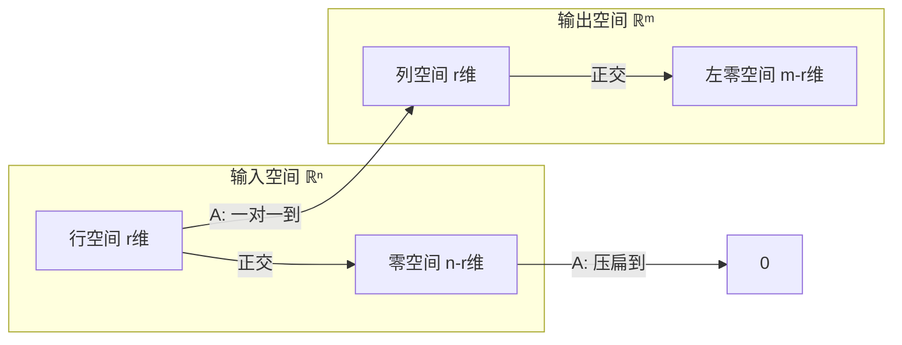

# 二、方程与子空间

## 6. 消元与 $A = LU$：解方程的正确方式

### 6.1 消元不只是「算」

考虑方程 $Ax = b$。你当然可以直接求逆矩阵（如果可逆的话），但求逆又慢又数值不稳定。正确的方式是**消元**——把 $A$ 变成上三角矩阵，然后从下往上代回去。

消元的实质不是操作步骤，而是**矩阵分解**：
$$A = LU$$

- $L$（下三角矩阵）：对角线上都是 1，非零元存放了每次消元用的乘数
- $U$（上三角矩阵）：消元后的结果

解 $Ax = b$ 变成两步：
1. 解 $Lc = b$（前向代入，$O(n^2)$）
2. 解 $Ux = c$（回代，$O(n^2)$）

比直接求逆快得多，也是所有数值线性代数的起点。

> 💡 **在 ML 里**：你不会手写消元，但 PyTorch 底层用了 $LU$ 分解的变体来做矩阵求逆和行列式计算。理解这一点，你就知道为什么「不要自己写矩阵求逆」——数值稳定性比你想象的重要。

---

## 7. 四个基本子空间：矩阵的「解剖学」

有了秩的概念，四个子空间才真正变得清晰。[前面](vectors-to-rank.md)我们学了「秩 = 列空间的维数」，现在把它放进完整的图景里。

### 7.1 矩阵做了什么：输入侧与输出侧

给定一个 $m \times n$ 矩阵 $A$（秩为 $r$）：

- **输入侧**（$\mathbb{R}^n$）：$A$ 接受一个 $n$ 维向量
- **输出侧**（$\mathbb{R}^m$）：$A$ 吐出一个 $m$ 维向量

输入侧有两类特殊的向量：

| 向量类型 | 定义 | 发生了什么 | 维数 |
|---------|------|-----------|------|
| **行空间的向量** | 可以被 $A$ 的行线性组合出来的向量 | 经过 $A$ 后变成列空间里的非零向量 | $r$ |
| **零空间的向量** | 满足 $Ax = 0$ 的向量 | 经过 $A$ 后被「压扁」到原点 | $n - r$ |

输出侧也有两类：

| 向量类型 | 定义 | 从哪里来 | 维数 |
|---------|------|---------|------|
| **列空间的向量** | 可以被 $A$ 的列线性组合出来的向量 | 由行空间的向量变换而来 | $r$ |
| **左零空间的向量** | 满足 $y^T A = 0$ 的向量 | 没有任何输入能产生它们 | $m - r$ |

注意：所有维数加起来刚好填满各自的整个空间——输入侧 $r + (n-r) = n$，输出侧 $r + (m-r) = m$。

### 7.2 四子空间关系图

- 行空间 $\perp$ 零空间，且两者的维数之和 = $n$（互补地张成整个输入空间）
- 列空间 $\perp$ 左零空间，且两者的维数之和 = $m$（互补地张成整个输出空间）
- $A$ 把行空间**完美地一一映射**到列空间（两者维数相同，都是 $r$）

### 7.3 有什么用

**$Ax = b$ 什么时候有解？** $b$ 必须在 $A$ 的列空间里。

**有多少个解？** 如果零空间不只有零向量（即 $r < n$），那么解 = 一个特解 + 零空间里的任意向量。无穷多个。

> 💡 **在 ML 里**：一个过参数化的神经网络有巨大的零空间——无穷多组权重能实现几乎相同的效果。正则化（L2 weight decay）就是从零空间里挑一个「范数最小的」。这不是玄学，是子空间几何。

---

## 8. 正交性与最小二乘：当精确解不存在

### 8.1 投影：找个「最近」的替身

如果 $b$ 不在 $A$ 的列空间里，$Ax = b$ 无解。退一步——找 $\hat{x}$，使得 $A\hat{x}$ 是列空间里离 $b$ 最近的点。

这个「最近点」就是 $b$ 在列空间上的**投影**：
$$\hat{x} = (A^T A)^{-1} A^T b$$

投影矩阵 $P = A(A^T A)^{-1} A^T$ 有两个标志性性质：
- $P^2 = P$：投一次和投两次一样（已经在「线」上了）
- $P^T = P$：对称

### 8.2 最小二乘 = 线性回归的数学

线性回归：找 $\beta$ 让 $X\beta \approx y$。这就是典型的「$b$ 不在列空间里」的问题。

$$\hat{\beta} = (X^T X)^{-1} X^T y$$

这个公式和上面 $\hat{x}$ 的公式**一模一样**——因为线性回归就是投影。你理解了投影，就理解了线性回归为什么长这样。

> 💡 **正交性在 ML 里渗透各处**：正交初始化（让权重矩阵的列不共线）、权重衰减（等价于在投影上加约束）、正交正则化——全部源于这里。

---

> **下一步**：[三、行列式、特征值与 SVD](determinant-eigen-svd.md) — 怎么把矩阵「拆开」看到它的内在结构。
