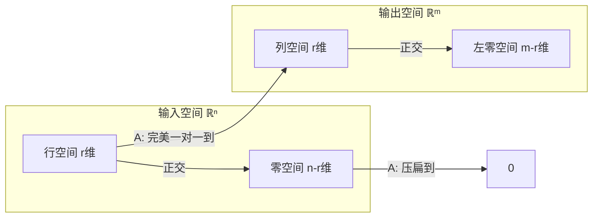

# 二、方程与子空间

## 6. 消元与 $A = LU$：解方程的正确方式

### 6.1 不只是「算」——消元就是矩阵分解

考虑 $Ax = b$。你当然可以 `torch.linalg.inv(A) @ b`，但直接求逆又慢又数值不稳定。正确姿势是**高斯消元**。

用矩阵的语言重说消元：把 $A$ 分解为
$$A = LU$$

- $L$（**L**ower triangular，下三角矩阵）：对角线上全是 1，非零元存储了每次消元时用的乘数
- $U$（**U**pper triangular，上三角矩阵）：消元后的结果，主元在对角线上

### 6.2 一个完整的手算例子

**原方程** $Ax = b$：

$$\begin{bmatrix} 2 & 1 & -1 \\ -3 & -1 & 2 \\ -2 & 1 & 2 \end{bmatrix} \begin{bmatrix} x_1 \\ x_2 \\ x_3 \end{bmatrix} = \begin{bmatrix} 8 \\ -11 \\ -3 \end{bmatrix}$$

**消元过程**：

要消掉第 2 行第 1 列的 $-3$，乘数是 $-\frac{3}{2}$。第 2 行 += $(-\frac{3}{2}) \times$ 第 1 行：

$$\rightarrow \begin{bmatrix} 2 & 1 & -1 \\ 0 & \frac{1}{2} & \frac{1}{2} \\ -2 & 1 & 2 \end{bmatrix}, \quad b \rightarrow \begin{bmatrix} 8 \\ 1 \\ -3 \end{bmatrix}$$

要消掉第 3 行第 1 列的 $-2$，乘数是 $-1$。第 3 行 += $(-1) \times$ 第 1 行：

$$\rightarrow \begin{bmatrix} 2 & 1 & -1 \\ 0 & \frac{1}{2} & \frac{1}{2} \\ 0 & 2 & 1 \end{bmatrix}, \quad b \rightarrow \begin{bmatrix} 8 \\ 1 \\ 5 \end{bmatrix}$$

要消掉第 3 行第 2 列的 2，乘数是 $4$。第 3 行 += $4 \times$ 第 2 行：

$$\rightarrow \underbrace{\begin{bmatrix} 2 & 1 & -1 \\ 0 & \frac{1}{2} & \frac{1}{2} \\ 0 & 0 & 3 \end{bmatrix}}_{U}, \quad b \rightarrow \underbrace{\begin{bmatrix} 8 \\ 1 \\ 9 \end{bmatrix}}_{c}$$

**回代**：$Ux = c$

1. $3x_3 = 9 \implies x_3 = 3$
2. $\frac{1}{2}x_2 + \frac{1}{2} \cdot 3 = 1 \implies x_2 = -1$
3. $2x_1 + (-1) - 3 = 8 \implies x_1 = 6$

解为 $x = \begin{bmatrix} 6 \\ -1 \\ 3 \end{bmatrix}$。验证：$2 \cdot 6 + (-1) - 3 = 8$ ✓

### 6.3 $A = LU$ 分解长什么样

上面每个消元步骤，本质是在**左边乘一个初等矩阵**。把所有这些初等矩阵的逆按顺序乘起来，就是 $L$：

$$L = \begin{bmatrix} 1 & 0 & 0 \\ -\frac{3}{2} & 1 & 0 \\ -1 & 4 & 1 \end{bmatrix}, \quad U = \begin{bmatrix} 2 & 1 & -1 \\ 0 & \frac{1}{2} & \frac{1}{2} \\ 0 & 0 & 3 \end{bmatrix}$$

可以验证 $LU = A$：

$$\begin{bmatrix} 1 & 0 & 0 \\ -\frac{3}{2} & 1 & 0 \\ -1 & 4 & 1 \end{bmatrix} \begin{bmatrix} 2 & 1 & -1 \\ 0 & \frac{1}{2} & \frac{1}{2} \\ 0 & 0 & 3 \end{bmatrix} = \begin{bmatrix} 2 & 1 & -1 \\ -3 & -1 & 2 \\ -2 & 1 & 2 \end{bmatrix} = A$$

解 $Ax = b$ 变成超快的两步：
1. 解 $Lc = b$（前向代入——从上往下，$O(n^2)$）
2. 解 $Ux = c$（回代——从下往上，$O(n^2)$）

总复杂度 $O(n^2)$，而直接求逆要 $O(n^3)$。并且不必重复——如果解多个 $b$，$L$ 和 $U$ 只需算一次。

> 💡 **在 ML 里**：你不会手写消元，但 PyTorch 的 `torch.linalg.solve` 底层就是 $LU$ 分解（或其变体）。理解了这一点，就会明白为什么「解 $Ax=b$」比「求 $A^{-1}$ 再乘」快得多、稳得多。

---

## 7. 四个基本子空间：矩阵的「解剖学」

[上一章](vectors-to-rank.md)我们学了秩 = 列空间的维数。现在把秩放进一个完整的结构里——每个矩阵都天然关联四个子空间。

### 7.1 给定一个矩阵，它在做什么

设 $A$ 是 $m \times n$ 矩阵，秩为 $r$。

- $A$ 接受 $n$ 维输入，产出 $m$ 维输出
- 有些输入被 $A$「压扁」成了零向量
- 有些输出是 $A$ 永远产生不了的

这四类构成了四个子空间：

**输入侧（$\mathbb{R}^n$）**：

| 子空间 | 定义 | 命运 | 维数 |
|--------|------|------|------|
| **行空间** $C(A^T)$ | $A$ 的行向量能张成的空间 | 经过 $A$ 后变成列空间里的非零向量 | $\color{blue}{r}$ |
| **零空间** $N(A)$ | 所有满足 $Ax=0$ 的 $x$ | 被 $A$「压扁」到原点 | $\color{red}{n-r}$ |

**输出侧（$\mathbb{R}^m$）**：

| 子空间 | 定义 | 来源 | 维数 |
|--------|------|------|------|
| **列空间** $C(A)$ | $A$ 的列向量能张成的空间 | 只有行空间里的向量能到达这里 | $\color{blue}{r}$ |
| **左零空间** $N(A^T)$ | 所有满足 $y^TA=0$ 的 $y$ | 没有任何输入能产生它们 | $\color{red}{m-r}$ |

维度加起来刚好填满：输入侧 $\color{blue}{r} + \color{red}{n-r} = n$，输出侧 $\color{blue}{r} + \color{red}{m-r} = m$。

### 7.2 一个具体矩阵的四个子空间

$$A = \begin{bmatrix} 1 & 2 \\ 2 & 4 \\ 3 & 6 \end{bmatrix}$$

这是一个 $3 \times 2$ 的矩阵。第二列 = 2 × 第一列 → **秩 $r = 1$**。

- **列空间**（在 $\mathbb{R}^3$ 中，维数 $r=1$）：所有 $c \begin{bmatrix} 1 \\ 2 \\ 3 \end{bmatrix}$。一条直线。
- **行空间**（在 $\mathbb{R}^2$ 中，维数 $r=1$）：所有 $c \begin{bmatrix} 1 \\ 2 \end{bmatrix}$。也是一条直线。
- **零空间**（在 $\mathbb{R}^2$ 中，维数 $n-r=1$）：满足 $x_1 + 2x_2 = 0$ 的所有向量，即所有 $c \begin{bmatrix} -2 \\ 1 \end{bmatrix}$。一条直线——和行空间**正交**。
- **左零空间**（在 $\mathbb{R}^3$ 中，维数 $m-r=2$）：满足 $y_1 + 2y_2 + 3y_3 = 0$ 的所有向量。一个平面——和列空间**正交**。

### 7.3 关系图

这个图是一张**精确的信息流地图**。所有 $n$ 维输入中，只有行空间里的向量能「活着通过」变换到达列空间。零空间里的全部牺牲。输出空间里，左零空间是「无人区」。

### 7.4 如何判断解的情况

**$Ax = b$ 有解吗？** 当且仅当 $b$ 在 $A$ 的列空间里。

**有几个解？** 如果零空间只有零向量（$r = n$，列满秩），解唯一。如果零空间有不止零向量（$r < n$），那么：

$$x = x_{\text{particular}} + x_{\text{nullspace}}$$

一个特解 + 零空间里的任意向量 = 全部解。无穷多个。

> 💡 **在 ML 里**：过参数化的神经网络（参数数 > 样本数）天然有巨大的零空间——无穷多组权重实现相同的训练损失。SGD 不加正则化时，到底收敛到哪个解？几何上，SGD 隐式地在零空间里选了「范数最小」的那个方向。L2 正则化是在显式地做同一件事。

---

## 8. 正交性与最小二乘：当 $b$ 不在列空间里

### 8.1 问题：精确解不存在

$b$ 几乎不可能恰好落在列空间里（尤其是数据有噪音时）。退而求其次：找一个 $\hat{x}$，使得 $A\hat{x}$ 是列空间里**离 $b$ 最近的点**。

这个最近点就是 $b$ 在列空间上的**正交投影**。

### 8.2 投影公式

$$\hat{x} = (A^T A)^{-1} A^T b$$

投影矩阵 $P = A(A^T A)^{-1} A^T$ 满足：
- $P^2 = P$：投两次 = 投一次（已经到了线上/面上）
- $P^T = P$：对称
- $I - P$ 投影到正交补空间

**一个简洁的例子**：把 $\begin{bmatrix} 3 \\ 4 \end{bmatrix}$ 投影到 $\begin{bmatrix} 1 \\ 1 \end{bmatrix}$ 张成的直线上。

$A = \begin{bmatrix} 1 \\ 1 \end{bmatrix}$，$A^T A = [2]$，$(A^T A)^{-1} = [\frac{1}{2}]$

$$P = A(A^T A)^{-1} A^T = \begin{bmatrix} 1 \\ 1 \end{bmatrix} \cdot \frac{1}{2} \cdot \begin{bmatrix} 1 & 1 \end{bmatrix} = \begin{bmatrix} \frac{1}{2} & \frac{1}{2} \\ \frac{1}{2} & \frac{1}{2} \end{bmatrix}$$

投影结果：$P b = \begin{bmatrix} \frac{1}{2} & \frac{1}{2} \\ \frac{1}{2} & \frac{1}{2} \end{bmatrix} \begin{bmatrix} 3 \\ 4 \end{bmatrix} = \begin{bmatrix} 3.5 \\ 3.5 \end{bmatrix}$——确实是 $\begin{bmatrix} 1 \\ 1 \end{bmatrix}$ 方向上离 $(3,4)$ 最近的点。

### 8.3 最小二乘 = 线性回归

线性回归模型：$y = X\beta + \varepsilon$

$$\hat{\beta} = (X^T X)^{-1} X^T y$$

和投影公式**完全一样**——线性回归就是 $y$ 在 $X$ 列空间上的投影。你一直在用投影，只是不知道它叫这个名字。

**误差 $y - X\hat{\beta}$ 垂直于 $X$ 的列空间**。这就是「最小」二乘的几何意义——误差向量和所有预测变量正交，在欧氏距离下不可能更近了。

> 💡 **在 ML 里的渗透**：正交初始化（让权重各列不共线 → 满秩 → 信息最大化）、正交正则化（约束权重接近正交阵）、权重衰减（等价于投影加 L2 约束）。正交性不是某个模型的特技——它是贯穿整个 ML 的底层几何。

---

> **下一步**：[三、行列式、特征值与 SVD](determinant-eigen-svd.md) —— 怎么把矩阵「拆开」，看到它内部的结构。
