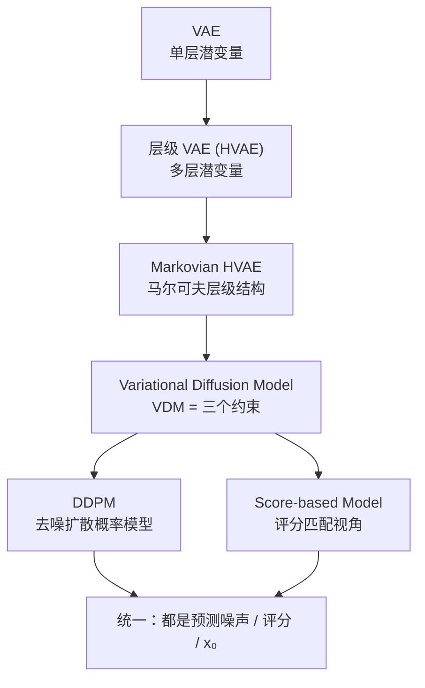
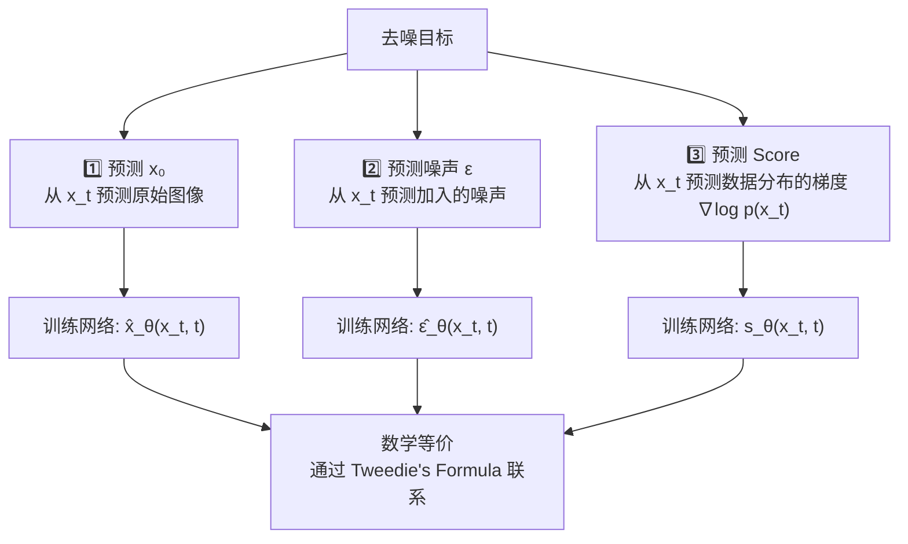
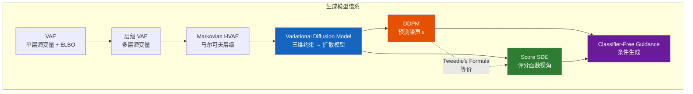

# Diffusion Models: A Unified Perspective

> 基于 Luo (2022) "Understanding Diffusion Models: A Unified Perspective" 的学习笔记。
> 本文从 VAE → 层级 VAE → 变分扩散模型 (VDM) → Score-based 模型的统一视角出发，
> 系统梳理扩散模型的数学推导、三种等价解释和引导方法。

---

## 一、统一视角：从 VAE 到扩散模型

Luo (2022) 的核心洞见：**扩散模型本质上是一个具有三个特殊约束的马尔可夫层级变分自编码器 (Markovian HVAE)。**

---

## 二、背景知识：ELBO 与 VAE

### 2.1 Evidence Lower Bound (ELBO)

对于观测数据 $\mathbf{x}$ 和潜变量 $\mathbf{z}$，我们想最大化似然 $p(\mathbf{x})$，但直接计算需要边际化：

$$p(\mathbf{x}) = \int p(\mathbf{x}, \mathbf{z})\, d\mathbf{z}$$

引入变分分布 $q_\phi(\mathbf{z}|\mathbf{x})$，通过 Jensen 不等式得到 ELBO：

$$\log p(\mathbf{x}) \geq \mathbb{E}_{q_\phi(\mathbf{z}|\mathbf{x})}\left[\log\frac{p(\mathbf{x}, \mathbf{z})}{q_\phi(\mathbf{z}|\mathbf{x})}\right] = \text{ELBO}$$

ELBO 可以分解为两项：

$$\mathbb{E}_{q_\phi(\mathbf{z}|\mathbf{x})}\left[\log\frac{p_\theta(\mathbf{x}, \mathbf{z})}{q_\phi(\mathbf{z}|\mathbf{x})}\right] = \underbrace{\mathbb{E}_{q_\phi}[\log p_\theta(\mathbf{x}|\mathbf{z})]}_{\text{重建项}} - \underbrace{D_\text{KL}(q_\phi(\mathbf{z}|\mathbf{x}) \| p(\mathbf{z}))}_{\text{先验匹配项}}$$

**直觉**：第一项鼓励好的重建，第二项鼓励潜变量分布接近先验（通常是标准高斯）。

### 2.2 Variational Autoencoder (VAE)

在标准 VAE 中：
- 编码器：$q_\phi(\mathbf{z}|\mathbf{x}) = \mathcal{N}(\mathbf{z}; \mu_\phi(\mathbf{x}), \sigma_\phi^2(\mathbf{x})\mathbf{I})$
- 解码器：$p_\theta(\mathbf{x}|\mathbf{z})$（从潜变量重建数据）
- 先验：$p(\mathbf{z}) = \mathcal{N}(\mathbf{z}; \mathbf{0}, \mathbf{I})$

---

## 三、层级 VAE → 变分扩散模型

### 3.1 Markovian Hierarchical VAE

层级 VAE 在 VAE 的基础上引入多层潜变量 $\mathbf{z}_1, \mathbf{z}_2, \ldots, \mathbf{z}_T$。Markovian HVAE 进一步假设：

$$q_\phi(\mathbf{z}_{1:T}|\mathbf{x}) = \prod_{t=1}^T q_\phi(\mathbf{z}_t|\mathbf{z}_{t-1})$$

即每一层潜变量只依赖上一层。

### 3.2 VDM 的三个关键约束

Luo 指出，VDM 就是在 Markovian HVAE 上施加三个约束：

| # | 约束 | 数学含义 |
|---|------|---------|
| 1 | **维度相等** | 潜变量维度 = 数据维度。记 $\mathbf{x}_t$ 替代 $\mathbf{z}_t$ |
| 2 | **编码器固定** | $q(\mathbf{x}_t|\mathbf{x}_{t-1})$ 不是学习的，而是预定义的线性高斯：$\mathcal{N}(\mathbf{x}_t; \sqrt{\alpha_t}\mathbf{x}_{t-1}, (1-\alpha_t)\mathbf{I})$ |
| 3 | **终态为标准高斯** | $p(\mathbf{x}_T) = \mathcal{N}(\mathbf{x}_T; \mathbf{0}, \mathbf{I})$ |

**直观理解**：这三个约束描述了一个**渐进的加噪过程**——逐步向图像注入高斯噪声，直到 $T$ 步后完全变成纯噪声。

### 3.3 前向过程

利用约束 2，前向加噪过程定义为：

$$q(\mathbf{x}_t | \mathbf{x}_{t-1}) = \mathcal{N}(\mathbf{x}_t; \sqrt{\alpha_t}\mathbf{x}_{t-1}, (1-\alpha_t)\mathbf{I})$$

利用重参数化技巧和独立高斯可加性，可以直接从 $\mathbf{x}_0$ 推导到任意 $\mathbf{x}_t$：

$$q(\mathbf{x}_t | \mathbf{x}_0) = \mathcal{N}(\mathbf{x}_t; \sqrt{\bar{\alpha}_t}\mathbf{x}_0, (1-\bar{\alpha}_t)\mathbf{I})$$

其中 $\bar{\alpha}_t = \prod_{i=1}^t \alpha_i$。重参数化形式为：

$$\mathbf{x}_t = \sqrt{\bar{\alpha}_t}\mathbf{x}_0 + \sqrt{1-\bar{\alpha}_t}\,\boldsymbol{\epsilon},\quad \boldsymbol{\epsilon}\sim\mathcal{N}(\mathbf{0},\mathbf{I})$$

### 3.4 逆向过程与 ELBO 推导

逆向去噪过程是我们要学习的：

$$p_\theta(\mathbf{x}_{0:T}) = p(\mathbf{x}_T)\prod_{t=1}^T p_\theta(\mathbf{x}_{t-1}|\mathbf{x}_t)$$

对 VDM 最大化 ELBO，经过推导得到：

$$\text{ELBO} = \mathbb{E}_{q}\left[\log\frac{p(\mathbf{x}_T)p_\theta(\mathbf{x}_0|\mathbf{x}_1)\prod_{t=2}^T p_\theta(\mathbf{x}_{t-1}|\mathbf{x}_t)}{q(\mathbf{x}_T|\mathbf{x}_{T-1})\prod_{t=1}^{T-1}q(\mathbf{x}_t|\mathbf{x}_{t-1})}\right]$$

进一步展开为：

$$\mathbb{E}_{q(\mathbf{x}_1|\mathbf{x}_0)}[\log p_\theta(\mathbf{x}_0|\mathbf{x}_1)] - D_\text{KL}(q(\mathbf{x}_T|\mathbf{x}_0) \| p(\mathbf{x}_T)) - \sum_{t=2}^T \mathbb{E}_{q(\mathbf{x}_t|\mathbf{x}_0)}[D_\text{KL}(q(\mathbf{x}_{t-1}|\mathbf{x}_t,\mathbf{x}_0) \| p_\theta(\mathbf{x}_{t-1}|\mathbf{x}_t))]$$

三项的直觉：
- **第一项**：重建项——从 $\mathbf{x}_1$ 恢复 $\mathbf{x}_0$
- **第二项**：先验匹配项——确保 $\mathbf{x}_T$ 接近标准高斯（通常可忽略）
- **第三项**：去噪匹配项——每一步去噪都和最优后验一致（**核心训练项**）

---

## 四、三种等价参数化

VDM 的核心训练目标可以等价地表达为以下三种形式——这是 Luo (2022) 论文中最重要的统一视角。

### 4.1 预测 $\mathbf{x}_0$（原始图像）

最直观的方式：训练网络直接从噪声图像预测原始图像。

$$\arg\min_\theta\; D_\text{KL}(q(\mathbf{x}_{t-1}|\mathbf{x}_t,\mathbf{x}_0) \| p_\theta(\mathbf{x}_{t-1}|\mathbf{x}_t))$$

去噪均值设置为：

$$\boldsymbol{\mu}_\theta(\mathbf{x}_t, t) = \frac{\sqrt{\alpha_t}(1-\bar{\alpha}_{t-1})\mathbf{x}_t + \sqrt{\bar{\alpha}_{t-1}}(1-\alpha_t)\hat{\mathbf{x}}_\theta(\mathbf{x}_t, t)}{1-\bar{\alpha}_t}$$

### 4.2 预测噪声 $\boldsymbol{\epsilon}$（DDPM 方式）

利用重参数化技巧：$\mathbf{x}_0 = (\mathbf{x}_t - \sqrt{1-\bar{\alpha}_t}\boldsymbol{\epsilon}_0) / \sqrt{\bar{\alpha}_t}$，可以转换为预测噪声：

$$\boldsymbol{\mu}_\theta(\mathbf{x}_t, t) = \frac{1}{\sqrt{\alpha_t}}\mathbf{x}_t - \frac{1-\alpha_t}{\sqrt{1-\bar{\alpha}_t}\sqrt{\alpha_t}}\hat{\boldsymbol{\epsilon}}_\theta(\mathbf{x}_t, t)$$

对应的**简化训练目标**（Ho et al. 2020 发现简化后效果更好）：

$$\mathcal{L}_{\text{simple}} = \mathbb{E}_{t, \mathbf{x}_0, \boldsymbol{\epsilon}}\left[\|\boldsymbol{\epsilon} - \hat{\boldsymbol{\epsilon}}_\theta(\mathbf{x}_t, t)\|^2\right]$$

> **这就是 DDPM 中著名的"预测噪声"训练方式，已经被证明在实践中效果最好。**

### 4.3 预测 Score（Score-based 模型）

通过 **Tweedie's Formula**：

$$\mathbb{E}[\boldsymbol{\mu}_x | \mathbf{x}_z] = \mathbf{x}_z + \Sigma_z \nabla_{\mathbf{x}_z} \log p(\mathbf{x}_z)$$

可证明去噪过程和评分函数（Score Function）的等价关系：

$$\nabla_{\mathbf{x}_t} \log p(\mathbf{x}_t) = -\frac{1}{\sqrt{1-\bar{\alpha}_t}}\boldsymbol{\epsilon}_0$$

因此，**预测噪声等价于学习数据分布的评分函数**（梯度场）。

这意味着：
- **VDM 学习去噪 → 等同于学习 score function**
- **采样过程 → 等同于 Langevin 动力学沿着 score 方向移动**
- **DDPM 和 Score SDE 本质上是同一事物的两种表述！**

---

## 五、学习噪声调度参数

在基础 VDM 中，$\alpha_t$（控制加噪速度）可以是预设超参数。但 Luo 指出，$\alpha_t$ 也可以作为**可学习参数**联合优化：

$$\nabla_{\alpha_t} \text{ELBO}$$

这允许模型自适应地学习最优的噪声调度策略，使得去噪任务在不同时间步之间达到平衡。

---

## 六、从 DDPM 到 Score SDE：连续极限

### 6.1 离散 → 连续

当 $T \to \infty$，离散的扩散过程变为连续时间随机过程。前向过程对应 **SDE**：

$$d\mathbf{x} = \underbrace{f(\mathbf{x}, t)}_{\text{漂移项}} dt + \underbrace{g(t)}_{\text{扩散项}} d\mathbf{w}$$

逆向过程对应 **reverse-time SDE**：

$$d\mathbf{x} = \left[f(\mathbf{x}, t) - g(t)^2 \nabla_\mathbf{x} \log p_t(\mathbf{x})\right] dt + g(t) d\bar{\mathbf{w}}$$

**核心洞察**：逆向 SDE 中唯一需要学习的是评分函数 $\nabla_\mathbf{x} \log p_t(\mathbf{x})$——这与 VDM 预测噪声完全等价！

### 6.2 VP-SDE 和 VE-SDE

| 类型 | SDE 形式 | 对应模型 |
|------|---------|---------|
| **VP-SDE** (Variance Preserving) | $d\mathbf{x} = -\frac{1}{2}\beta(t)\mathbf{x}dt + \sqrt{\beta(t)}d\mathbf{w}$ | DDPM |
| **VE-SDE** (Variance Exploding) | $d\mathbf{x} = \sqrt{d[\sigma^2(t)]/dt}\,d\mathbf{w}$ | Score SDE (Song et al.) |

---

## 七、Guidance：控制生成内容

仅仅无条件生成是不够的，我们常需要**引导模型生成特定类别或满足文本描述的图像**。

### 7.1 Classifier Guidance

在采样时，利用一个预训练的分类器 $p_\phi(y|\mathbf{x}_t)$ 来引导生成方向。关键是修改评分函数：

$$\nabla_{\mathbf{x}_t} \log p(\mathbf{x}_t | y) = \underbrace{\nabla_{\mathbf{x}_t} \log p(\mathbf{x}_t)}_{\text{无条件评分}} + \gamma \underbrace{\nabla_{\mathbf{x}_t} \log p_\phi(y | \mathbf{x}_t)}_{\text{分类器梯度}}$$

将修改后的评分代入去噪均值：

$$\hat{\boldsymbol{\mu}}_\theta(\mathbf{x}_t, t) = \boldsymbol{\mu}_\theta(\mathbf{x}_t, t) + s \cdot \Sigma_\theta(\mathbf{x}_t, t) \nabla_{\mathbf{x}_t} \log p_\phi(y | \mathbf{x}_t)$$

其中 $s$ 控制引导强度：
- $s=0$：无条件生成
- $s>0$：引导强度增大 → 生成质量提升但多样性下降
- $s$ 过大 → 对抗效应（adversarial effect）

### 7.2 Classifier-Free Guidance（无需分类器的引导）

Classifier-Free Guidance 不需要额外的分类器，而是**联合训练条件模型和无条件模型**：

训练时随机丢弃条件 $c$（通常是文本 prompt），使模型同时学习：

$$\hat{\boldsymbol{\epsilon}}_\theta(\mathbf{x}_t, t) \quad\text{和}\quad \hat{\boldsymbol{\epsilon}}_\theta(\mathbf{x}_t, t, c)$$

采样时，将条件评分和无条件评分做外推：

$$\hat{\boldsymbol{\epsilon}} = \underbrace{\hat{\boldsymbol{\epsilon}}_\theta(\mathbf{x}_t, t)}_{\text{无条件预测}} + w \cdot \underbrace{(\hat{\boldsymbol{\epsilon}}_\theta(\mathbf{x}_t, t, c) - \hat{\boldsymbol{\epsilon}}_\theta(\mathbf{x}_t, t))}_{\text{条件修正方向}}$$

其中 $w$ 为引导权重。

**这是 Stable Diffusion、DALL·E 2、Imagen 等主流文生图模型使用的核心技术。**

---

## 八、统一视角总结

| 解读视角 | 训练目标 | 采样方式 |
|---------|---------|---------|
| **VAE 视角** | 最大化 ELBO | 层级解码 |
| **DDPM 视角** | 预测噪声 $\boldsymbol{\epsilon}$ | 迭代去噪 |
| **Score 视角** | 学习评分函数 $\nabla\log p$ | Langevin 动力学 / SDE 求解 |
| **Guidance 视角** | 条件评分修正 | 引导采样 |

---

## 九、扩散模型安全

与我的研究方向交叉：

- **扩散模型能否被 unlearn？** 概念擦除（Concept Erasure）与遗忘是否等价？
- **后门攻击**：在扩散模型的加噪/去噪过程中植入 trigger
- **成员推理攻击**：扩散模型是否比 GAN 更容易泄露训练数据？
- **鲁棒评测**：扩散模型生成内容的安全和质量评测框架

---

## 十、💭 个人理解与延伸思考

> 读 Luo (2022) 的过程中，以下是我觉得最有收获的几个洞察。

### 10.1 为什么代码里算 L2 Loss 就行？—— KL 退化的精妙之处

实际写 DDPM 代码时，Loss 就是拿网络输出跟噪声 $\boldsymbol{\epsilon}$ 做 MSE。但为什么可以这么简单？Luo 的公式 (87) → (130) 给出了严格推导：

1. **真实去噪分布的方差已知**（由 $\alpha_t$ 确定），不依赖网络学习
2. 因此 $D_{\text{KL}}$ **退化成了对均值的 L2 距离**
3. 均值预测又通过**重参数化**等价于噪声预测

$$D_{\text{KL}}(q(\mathbf{x}_{t-1}|\mathbf{x}_t,\mathbf{x}_0) \| p_\theta(\mathbf{x}_{t-1}|\mathbf{x}_t)) = \frac{1}{2\sigma_q^2}\|\boldsymbol{\mu}_q - \boldsymbol{\mu}_\theta\|^2$$

**这条推导链打通了"数学上的 ELBO"和"代码里的 MSE"之间的壁垒，不再靠信仰编程。**

### 10.2 Tweedie's Formula：桥梁公式

$$\mathbb{E}[\boldsymbol{\mu}_x | \mathbf{x}_z] = \mathbf{x}_z + \Sigma_z \nabla_{\mathbf{x}_z} \log p(\mathbf{x}_z)$$

> Tweedie's Formula 是串联「预测原图 $\hat{\mathbf{x}}_0$」和「估计 Score $\nabla\log p$」的核心枢纽。

它的直觉：如果你有一个带噪声的观测，想估计真实信号，可以用**噪声的方差**乘以**概率密度的梯度**来修正。

正是这条公式，让 VDM 的「去噪」和 Score-based 的「梯度场」在数学上严格等价——这是整个统一视角中**最关键的一步推导**。

### 10.3 CFG 的优雅一行

Classifier-Free Guidance 的数学本质**极其简单**：

$$\hat{\boldsymbol{\epsilon}} = \boldsymbol{\epsilon}_\theta(\mathbf{x}_t, t) + w \cdot (\boldsymbol{\epsilon}_\theta(\mathbf{x}_t, t, c) - \boldsymbol{\epsilon}_\theta(\mathbf{x}_t, t))$$

理解：**沿着条件方向走一步，再额外朝远离无条件方向走 $w-1$ 步**。

- $w=1$ → 普通条件生成
- $w=7.5$（Stable Diffusion 默认）→ **增强 prompt 对齐，但牺牲多样性**
- 训练时的随机 dropout 让同一个网络学会两种预测

### 10.4 从 VDM 到 Latent Diffusion：科研发展的顺理成章

Luo 在 Shortcomings 中明确指出：**VDM 的隐变量和原图维度一样，不具备数据压缩和抽象特征提取能力**。

这完美解释了为什么后来出现了 **Latent Diffusion Models (Stable Diffusion)**：
1. 先用一个 VAE 把图像压缩到低维 Latent 空间
2. 在这个低维空间里做扩散
3. 大幅降低计算成本 + 获得可解释的语义隐空间

> 把 Luo (2022) 和 Rombach et al. (2022) 连起来读，会发现科研发展的脉络**草蛇灰线、顺理成章**——这对以后找 Motivation 非常有启发。

### 10.5 未解决的问题

| 问题 | 说明 |
|------|------|
| **SDE 离散化** | 如何将连续 SDE 离散化为极少步的 ODE 求解器（DDIM、DPM-Solver）？这是工程落地的关键 |
| **SNR 学习** | Luo 提到的 SNR 网络动态学习 $\alpha_t$ 的方案，为什么没成为主流？（实践中都用预设的 cosine/linear schedule） |
| **隐空间质量** | LDM 的 VAE 编码器本身也需要被「遗忘」——如果 VAE 泄露了训练数据怎么办？ |

---

## 参考论文

1. **Luo, C.** (2022). *Understanding Diffusion Models: A Unified Perspective.* arXiv:2208.11970.  
   → 本文的主要参考来源，从 VAE → HVAE → VDM → Score SDE 的统一数学推导。

2. **Ho, J., Jain, A., & Abbeel, P.** (2020). *Denoising Diffusion Probabilistic Models.* NeurIPS 2020.  
   → DDPM 原始论文，提出预测噪声的简化训练目标 $\mathcal{L}_{\text{simple}}$。

3. **Song, J., Meng, C., & Ermon, S.** (2021). *Denoising Diffusion Implicit Models.* ICLR 2021.  
   → DDIM：确定性采样，大幅加速生成过程。

4. **Song, Y., Sohl-Dickstein, J., et al.** (2021). *Score-Based Generative Modeling through Stochastic Differential Equations.* ICLR 2021.  
   → Score SDE 统一框架，将 DDPM 推广到连续时间。

5. **Kingma, D. P., & Welling, M.** (2014). *Auto-Encoding Variational Bayes.* ICLR 2014.  
   → VAE 原始论文，ELBO 的经典推导。

6. **Sohl-Dickstein, J., et al.** (2015). *Deep Unsupervised Learning using Nonequilibrium Thermodynamics.* ICML 2015.  
   → 扩散模型的起源——非平衡热力学的深度学习应用。

7. **Dhariwal, P., & Nichol, A.** (2021). *Diffusion Models Beat GANs on Image Synthesis.* NeurIPS 2021.  
   → Classifier Guidance，展示扩散模型在图像生成上超越 GAN。

8. **Ho, J., & Salimans, T.** (2021). *Classifier-Free Diffusion Guidance.* NeurIPS 2021 Workshop.  
   → Classifier-Free Guidance 原始论文。

9. **Nichol, A., & Dhariwal, P.** (2021). *Improved Denoising Diffusion Probabilistic Models.* ICML 2021.  
   → 改进的 DDPM：学习 $\Sigma_\theta$ 和最优噪声调度。

10. **Rombach, R., et al.** (2022). *High-Resolution Image Synthesis with Latent Diffusion Models.* CVPR 2022.  
    → Stable Diffusion / Latent Diffusion：在潜空间做扩散，大幅降低计算成本。
